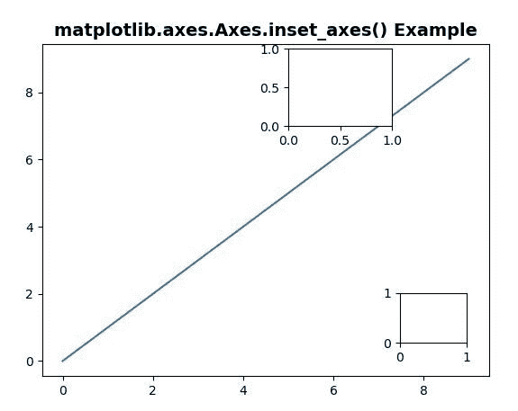
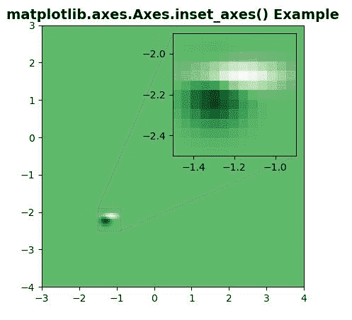

# Python 中的 matplotlib . axes . axes . insert _ axes()

> 原文:[https://www . geeksforgeeks . org/matplotlib-axes-axes-inset _ axes-in-python/](https://www.geeksforgeeks.org/matplotlib-axes-axes-inset_axes-in-python/)

**[Matplotlib](https://www.geeksforgeeks.org/python-introduction-matplotlib/)** 是 Python 中的一个库，是 NumPy 库的数值-数学扩展。**轴类**包含了大部分的图形元素:轴、刻度、线二维、文本、多边形等。，并设置坐标系。Axes 的实例通过回调属性支持回调。

## matplotlib . axes . axes . insert _ axes()函数

matplotlib 库的 Axes 模块中的**axes . insert _ axes()函数**也用于在这个现有的轴上添加一个子插入轴。

> **语法:**axes . insert _ axes(self，boundaries，* transform = None，zorder=5，**kwargs)
> 
> **参数:**该方法接受以下描述的参数:
> 
> *   **边界:**这个参数是嵌入轴的左下角，以及它的宽度和`height.[x0, y0, width, height]`
> *   **变换:**该参数是矩形的单位在轴-相对坐标中。
> *   **zorder:** 此参数包含数字，默认值为 5。
> 
> **返回:**该方法返回**斧头**，这是创建的斧头实例。

**注意:**该功能在 Matplotlib 版本>中工作= 3.0

下面的例子说明了 matplotlib.axes . axes . insert _ axes()函数在 matplotlib . axes 中的作用:

**例 1:**

```py
# Implementation of matplotlib function
import matplotlib.pyplot as plt

fig, ax = plt.subplots()
ax.plot(range(10))
axin1 = ax.inset_axes([0.8, 0.1, 
                       0.15, 0.15])
axin2 = ax.inset_axes(
        [5, 7, 2.3, 2.3], transform = ax.transData)

ax.set_title('matplotlib.axes.Axes.inset_axes() Example',
              fontsize = 14, fontweight ='bold')
plt.show()
```

**输出:**


**例 2:**

```py
# Implementation of matplotlib function
import matplotlib.pyplot as plt
import numpy as np

def geeks():
    from matplotlib.cbook import get_sample_data
    import numpy as np
    f = get_sample_data("axes_grid / bivariate_normal.npy", 
                        asfileobj = False)
    z = np.load(f)
    return z, (-3, 4, -4, 3)

fig, ax = plt.subplots()

X, extent = geeks()
Z2 = np.zeros([150, 150], dtype ="g")
ny, nx = X.shape
Z2[30:30 + ny, 30:30 + nx] = X

ax.imshow(Z2, extent = extent, 
          interpolation ="nearest",
          origin ="lower", cmap ="Greens")

axins = ax.inset_axes([0.5, 0.5, 0.47, 0.47])

axins.imshow(Z2, extent = extent,
            interpolation ="nearest",
            origin ="lower", cmap ="Greens")
x1, x2, y1, y2 = -1.5, -0.9, -2.5, -1.9
axins.set_xlim(x1, x2)
axins.set_ylim(y1, y2)

ax.indicate_inset_zoom(axins)

ax.set_title('matplotlib.axes.Axes.inset_axes() Example',
             fontsize = 14, fontweight ='bold')
plt.show()
```

**输出:**
