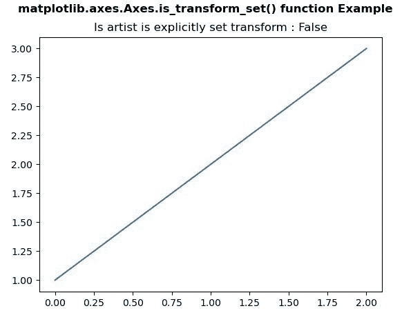
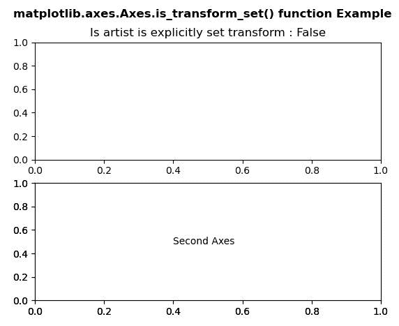

# Python 中的 matplotlib . axes . axes . is _ transform _ set()

> 原文:[https://www . geeksforgeeks . org/matplotlib-axes-axes-is _ transform _ set-in-python/](https://www.geeksforgeeks.org/matplotlib-axes-axes-is_transform_set-in-python/)

**[Matplotlib](https://www.geeksforgeeks.org/python-introduction-matplotlib/)** 是 Python 中的一个库，是 NumPy 库的数值-数学扩展。**轴类**包含了大部分的图形元素:轴、刻度、线二维、文本、多边形等。，并设置坐标系。Axes 的实例通过回调属性支持回调。

## matplotlib . axes . axes . is _ transform _ set()函数

matplotlib 库的 Axes 模块中的 **Axes.is_transform_set()函数**用于获取 Artist 是否有显式设置的变换。

> **语法:** Axes.is_transform_set(self)
> 
> **参数:**该方法不接受任何参数。
> 
> **返回:**该方法返回艺术家是否有显式设置的变换。

下面的例子说明了 matplotlib.axes . axes . is _ transform _ set()函数在 matplotlib . axes 中的作用:

**例 1:**

```
# Implementation of matplotlib function
import matplotlib.pyplot as plt

fig, axs = plt.subplots()
axs.plot([1, 2, 3])

axs.set_title("Is artist is explicitly set transform : "
              +str(axs.is_transform_set()))

fig.suptitle('matplotlib.axes.Axes.is_transform_set() \
function Example', fontweight ="bold")

plt.show()
```

**输出:**


**例 2:**

```
# Implementation of matplotlib function
import matplotlib.pyplot as plt

fig, (axs, axs2) = plt.subplots(2, 1)
gs = axs2.get_gridspec()

axbig = fig.add_subplot(gs[1:, -1])
axbig.annotate("Second Axes", (0.4, 0.5),
               xycoords ='axes fraction',
               va ='center')

axs.set_title("Is artist is explicitly set transform : "
              +str(axs.is_transform_set()))

fig.suptitle('matplotlib.axes.Axes.is_transform_set() \
function Example', fontweight ="bold")

plt.show()
```

**输出:**
