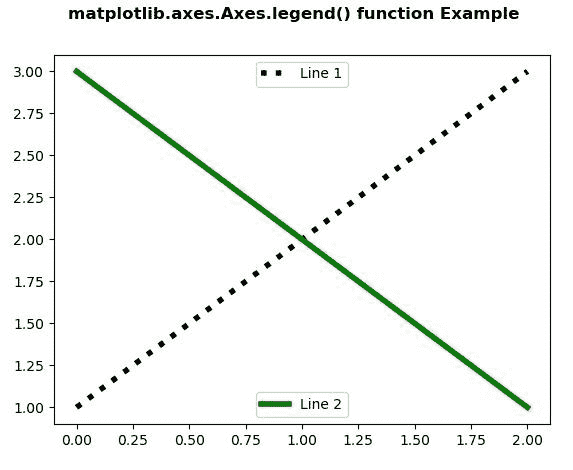
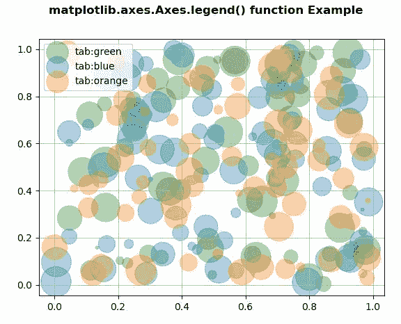

# Python 中的 Matplotlib.axes.Axes.legend()

> 原文:[https://www . geeksforgeeks . org/matplotlib-axes-axes-legend-in-python/](https://www.geeksforgeeks.org/matplotlib-axes-axes-legend-in-python/)

**[Matplotlib](https://www.geeksforgeeks.org/python-introduction-matplotlib/)** 是 Python 中的一个库，是 NumPy 库的数值-数学扩展。**轴类**包含了大部分的图形元素:轴、刻度、线二维、文本、多边形等。，并设置坐标系。Axes 的实例通过回调属性支持回调。

## matplotlib.axes.Axes.legend()函数

matplotlib 库的 Axes 模块中的 **Axes.legend()函数**用于在轴上放置图例。

> **语法:** Axes.legend(self，*args，**kwargs)
> 
> **参数:**该方法接受以下参数。
> 
> *   **标签:**此参数是要显示在艺术家旁边的标签列表。
> *   **手柄:**此参数是要添加到图例中的艺术家(线条、面片)列表。
> 
> **返回:**该方法返回 **matplotlib.legend.Legend** 实例。

下面的例子说明了 matplotlib.axes.Axes.legend()函数在 matplotlib.axes 中的作用:

**例 1:**

```py
# Implementation of matplotlib function
import matplotlib.pyplot as plt

fig, ax = plt.subplots()

line1, = ax.plot([1, 2, 3],
                 label ="Line 1",
                 color ="black", 
                 linewidth = 4,
                 linestyle =':')

line2, = ax.plot([3, 2, 1], 
                 label ="Line 2",
                 color ="green", 
                 linewidth = 4)

first_legend = ax.legend(handles =[line1], 
                         loc ='upper center')

ax.add_artist(first_legend)

ax.legend(handles =[line2], loc ='lower center')

fig.suptitle('matplotlib.axes.Axes.legend() \
function Example\n', fontweight ="bold")

plt.show()
```

**输出:**


**例 2:**

```py
# Implementation of matplotlib function
import numpy as np
import matplotlib.pyplot as plt

np.random.seed(19680801)

fig, ax = plt.subplots()
for color in [ 'tab:green', 'tab:blue',
               'tab:orange']:
    n = 70
    x, y = np.random.rand(2, n)
    scale = 1000.0 * np.random.rand(n)
    ax.scatter(x, y, c = color, s = scale,
               label = color,
               alpha = 0.35)

ax.legend()
ax.grid(True)
fig.suptitle('matplotlib.axes.Axes.legend() function\
 Example\n', fontweight ="bold")

plt.show()
```

**输出:**
