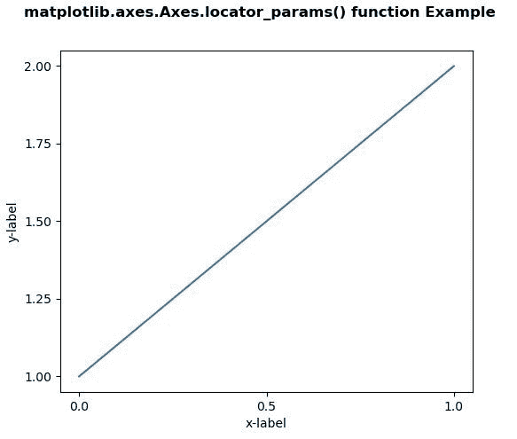
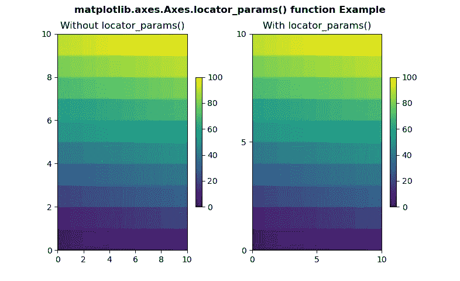

# Python 中的 matplotlib . axes . axes . locator _ params()

> 原文:[https://www . geeksforgeeks . org/matplotlib-axes-axes-locator _ params-in-python/](https://www.geeksforgeeks.org/matplotlib-axes-axes-locator_params-in-python/)

**[Matplotlib](https://www.geeksforgeeks.org/python-introduction-matplotlib/)** 是 Python 中的一个库，是 NumPy 库的数值-数学扩展。**轴类**包含了大部分的图形元素:轴、刻度、线二维、文本、多边形等。，并设置坐标系。Axes 的实例通过回调属性支持回调。

## matplotlib . axes . axes . locator _ params()函数

matplotlib 库的 Axes 模块中的 **Axes.locator_params()函数**用于控制主要刻度定位器的行为。

> **语法:** Axes.locator_params(self，axis='both '，tight = None，**kwargs)
> 
> **参数:**该方法接受以下参数。
> 
> *   **axis :** This parameter is the axis on which to operate
>     
>     。
>     
>     
> *   **紧密:**该参数被传递给 autoscale_view。默认值为无，表示没有更改。
> 
> **返回值:**此方法不返回值。

下面的例子说明了 matplotlib.axes 中的`matplotlib.axes.Axes.locator_params()`函数:

**例 1:**

```py
# Implementation of matplotlib function
import matplotlib.pyplot as plt
import matplotlib.colors as mcolors
import matplotlib.gridspec as gridspec
import numpy as np

plt.rcParams['savefig.facecolor'] = "0.8"
plt.rcParams['figure.figsize'] = 6, 5

fig, ax = plt.subplots()

ax.plot([1, 2])

ax.locator_params("x", nbins = 3)
ax.locator_params("y", nbins = 5)

ax.set_xlabel('x-label')
ax.set_ylabel('y-label')

fig.suptitle('matplotlib.axes.Axes.locator_params() \
function Example\n\n', fontweight ="bold")
plt.show()
```

**输出:**


**例 2:**

```py
# Implementation of matplotlib function
import matplotlib.pyplot as plt
import matplotlib.colors as mcolors
import matplotlib.gridspec as gridspec
import numpy as np

arr = np.arange(100).reshape((10, 10))
norm = mcolors.Normalize(vmin = 0., vmax = 100.)

pc_kwargs = {'rasterized': True, 'cmap': 'viridis',
             'norm': norm}

fig, (ax, ax1) = plt.subplots(1, 2)

im = ax.pcolormesh(arr, **pc_kwargs)
fig.colorbar(im, ax = ax, shrink = 0.6)

im1 = ax1.pcolormesh(arr, **pc_kwargs)
ax1.locator_params(nbins = 3)
fig.colorbar(im1, ax = ax1, shrink = 0.6)

ax.set_title("Without locator_params()")
ax1.set_title("With locator_params()")

fig.suptitle('matplotlib.axes.Axes.locator_params() \
function Example\n\n', fontweight ="bold")
plt.show()
```

**输出:**
