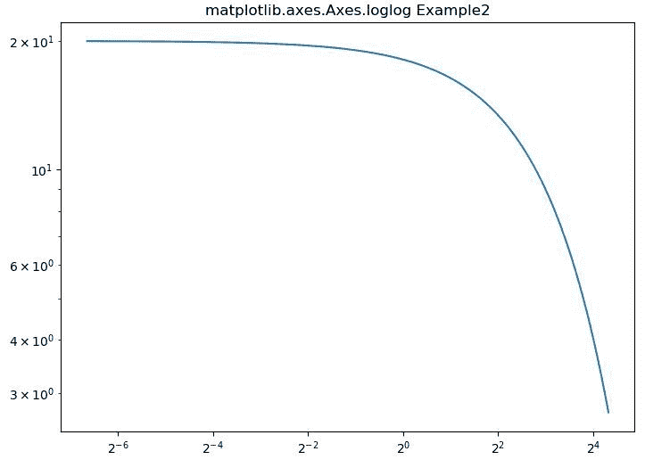
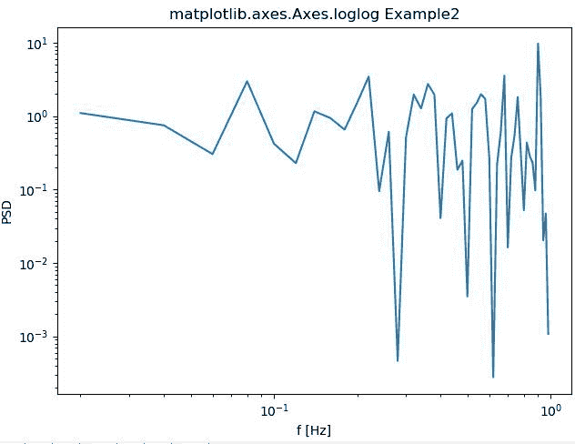

# matplotlib . axes . log log()中的 Python

> 哎哎哎:# t0]https://www . geeksforgeeks . org/matplot lib-axes-loglog-in-python/

**[Matplotlib](https://www.geeksforgeeks.org/python-introduction-matplotlib/)** 是 Python 中的一个库，是 NumPy 库的数值-数学扩展。**轴类**包含了大部分的图形元素:轴、刻度、线二维、文本、多边形等。，并设置坐标系。Axes 的实例通过回调属性支持回调。

## matplotlib.axes.Axes.loglog()函数

matplotlib 库的 Axes 模块中的 **Axes.errorbar()函数**用于在 x 轴和 y 轴上进行对数缩放的绘图。

> **语法:**
> 
> ```py
> Axes.loglog(self, *args, **kwargs)
> ```
> 
> **参数:**该方法接受以下描述的参数:
> 
> *   **basex，basey:** 这些参数是 x/y 对数的底数，可以选择默认值 *10* 。
> *   **子刻度，子刻度:**这些参数是次要 x/y 刻度的位置序列，是可选的。
> *   **nonpsx，nonpsy:**这些参数是 x 或 y 中的非正值，可以被屏蔽为无效，或者被裁剪为非常小的正数。
> 
> **返回:**这将返回以下内容:
> 
> *   **线:**这将返回表示打印数据的线 2D 对象列表..

下面的例子说明了 matplotlib.axes.Axes.loglog()函数在 matplotlib.axes 中的作用:

**示例-1:**

```py
# Implementation of matplotlib function

import numpy as np
import matplotlib.pyplot as plt

t = np.arange(0.01, 20.0, 0.01)

# Create figure
fig, ax = plt.subplots()

# log x and y axis
ax.loglog(t, 20 * np.exp(-t / 10.0), basex = 2)

ax.set_title('matplotlib.axes.Axes.loglog Example2')
plt.show()
```

**输出:**


**示例-2:**

```py
# Implementation of matplotlib function

import numpy as np
import matplotlib.pyplot as plt

fig, ax = plt.subplots(constrained_layout = True)
x = np.arange(0.02, 1, 0.02)
np.random.seed(19680801)
y = np.random.randn(len(x)) ** 2
ax.loglog(x, y)
ax.set_xlabel('f [Hz]')
ax.set_ylabel('PSD')
ax.set_title('Random spectrum')

def forward(x):
    return 1 / x

def inverse(x):
    return 1 / x

ax.set_title('matplotlib.axes.Axes.loglog Example2')
plt.show()
```

**输出:**
