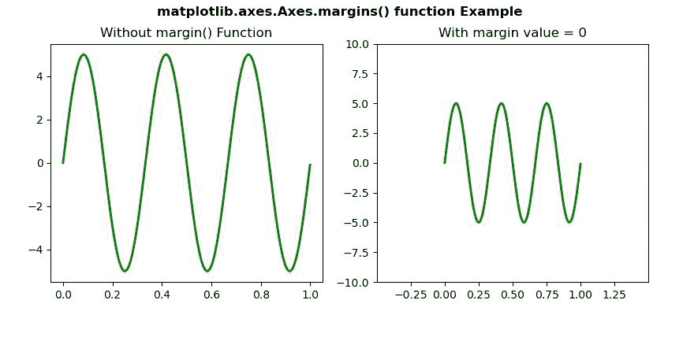
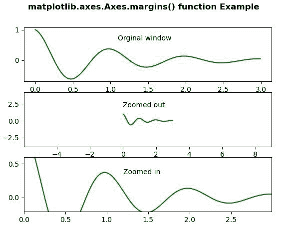

# Python 中的 matplotlib . axes . axes . margin()

> 原文:[https://www . geeksforgeeks . org/matplotlib-axes-axes-margins-in-python/](https://www.geeksforgeeks.org/matplotlib-axes-axes-margins-in-python/)

[**Matplotlib**](https://www.geeksforgeeks.org/python-introduction-matplotlib/) 是 Python 中的一个库，是 NumPy 库的数值-数学扩展。**轴类**包含了大部分的图形元素:轴、刻度、线二维、文本、多边形等。，并设置坐标系。Axes 的实例通过回调属性支持回调。

matplotlib.axes.Axes.margins() Function

matplotlib 库的 Axes 模块中的 **Axes.margins()函数**用于设置或检索自动缩放边距。

> **语法:**axes . margin(self，* margins，x=None，y=None，紧绷=True)
> **参数:**此方法接受以下参数。
> 
> *   ***边距:**此参数用于指定 x 轴和 y 轴限制的边距。
> *   **x，y:** 这些参数分别用于 x 轴和 y 轴的特定边距值。
> *   **紧密:**此参数传递给 autoscale_view()，该参数在边距更改后执行。
> 
> **返回值:**此方法返回以下值。
> 
> *   边缘
> *   边缘

以下示例说明 matplotlib.axes.Axes.margins()函数在 matplotlib.axes:
**示例 1:**

## 蟒蛇 3

```py
# Implementation of matplotlib function 
import numpy as np
import matplotlib.pyplot as plt
from matplotlib.widgets import Slider, Button, RadioButtons

fig, (ax, ax1) = plt.subplots(1, 2)
plt.subplots_adjust(bottom = 0.25)
t = np.arange(0.0, 1.0, 0.001)
a0 = 5
f0 = 3
delta_f = 5.0
s = a0 * np.sin(2 * np.pi * f0 * t)
ax.plot(t, s, lw = 2, color = 'green')

ax1.plot(t, s, lw = 2, color = 'green')
ax1.margins(0.5)

ax.set_title("Without margin() Function")
ax1.set_title("With margin value = 0")

fig.suptitle('matplotlib.axes.Axes.margins() function \
Example\n', fontweight ="bold")
fig.canvas.draw()
plt.show()
```

**输出:**



**例 2:**

## 蟒蛇 3

```py
# Implementation of matplotlib function 
import numpy as np
import matplotlib.pyplot as plt

t = np.arange(0.0, 3.0, 0.01)
t1 = np.exp(-t) * np.cos(2 * np.pi * t)

fig, [ax1, ax2, ax3] = plt.subplots(nrows = 3)
ax1.plot(t, t1, color ="green")
ax1.text(1.1, 0.65, 'Original window')

ax2.margins(2, 2)
ax2.plot(t, t1, color ="green")
ax2.text(0, 2.0, 'Zoomed out')

ax3.margins(x = 0, y =-0.25)
ax3.plot(t, t1, color ="green")
ax3.text(1.2, 0.35, 'Zoomed in')

fig.suptitle('matplotlib.axes.Axes.margins() function\
 Example\n', fontweight ="bold")
fig.canvas.draw()
plt.show()
```

**输出:**

