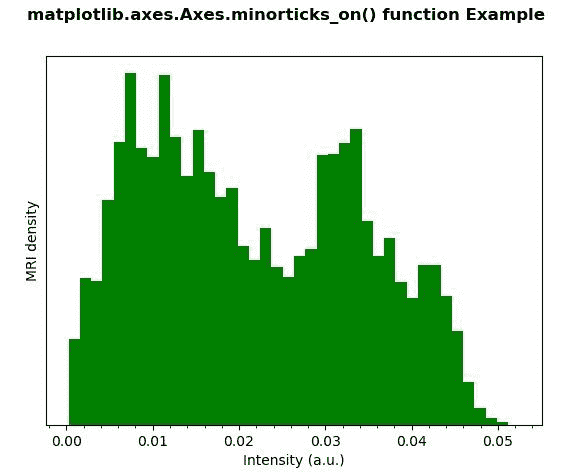
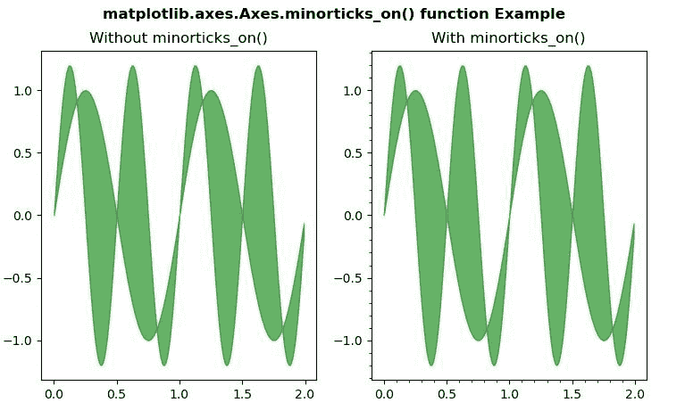

# Python 中的 matplotlib . axes . axes . min articks _ on()

> 原文:[https://www . geeksforgeeks . org/matplotlib-axes-axes-min articks _ on-in-python/](https://www.geeksforgeeks.org/matplotlib-axes-axes-minorticks_on-in-python/)

**[Matplotlib](https://www.geeksforgeeks.org/python-introduction-matplotlib/)** 是 Python 中的一个库，是 NumPy 库的数值-数学扩展。**轴类**包含了大部分的图形元素:轴、刻度、线二维、文本、多边形等。，并设置坐标系。Axes 的实例通过回调属性支持回调。

## matplotlib . axes . axes . min articks _ on()函数

matplotlib 库的 Axes 模块中的**axes . minarticks _ on()函数**用于显示轴上的次要刻度。

**语法:**

```py
Axes.minorticks_on(self)

```

下面的例子说明了 matplotlib.axes . axes . min articks _ on()函数在 matplotlib . axes 中的作用:

**例 1:**

```py
# Implementation of matplotlib function
import numpy as np
import matplotlib.pyplot as plt
import matplotlib.cbook as cbook
import matplotlib.cm as cm

from matplotlib.collections import LineCollection
from matplotlib.ticker import MultipleLocator

with cbook.get_sample_data('s1045.ima.gz') as dfile:
    im = np.frombuffer(dfile.read(),
                       np.uint16).reshape((256, 256))

fig, ax1 = plt.subplots()
im = np.ravel(im)
im = im[np.nonzero(im)] 
im = im / (2**20 - 1)
ax1.hist(im, bins = 40, color ="green")
ax1.set_yticks([])
ax1.set_xlabel('Intensity (a.u.)')
ax1.set_ylabel('MRI density')
ax1.minorticks_on()

fig.suptitle('matplotlib.axes.Axes.minorticks_on() \
function Example\n\n', fontweight ="bold")
plt.show()
```

**输出:**


**例 2:**

```py
# Implementation of matplotlib function
import matplotlib.pyplot as plt
import numpy as np

x = np.arange(0.0, 2, 0.01)
y1 = np.sin(2 * np.pi * x)
y2 = 1.2 * np.sin(4 * np.pi * x)

fig, (ax, ax1) = plt.subplots(1, 2)

ax.fill_between(x, y1, y2, color ="green",
                alpha = 0.6)
ax.set_title("Without minorticks_on()")

ax1.fill_between(x, y1, y2, color ="green",
                 alpha = 0.6)
ax1.minorticks_on()
ax1.set_title("With minorticks_on()")

fig.suptitle('matplotlib.axes.Axes.minorticks_on()\
 function Example\n\n', fontweight ="bold")
plt.show()
```

**输出:**
