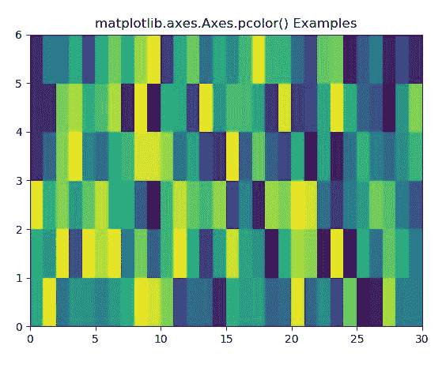
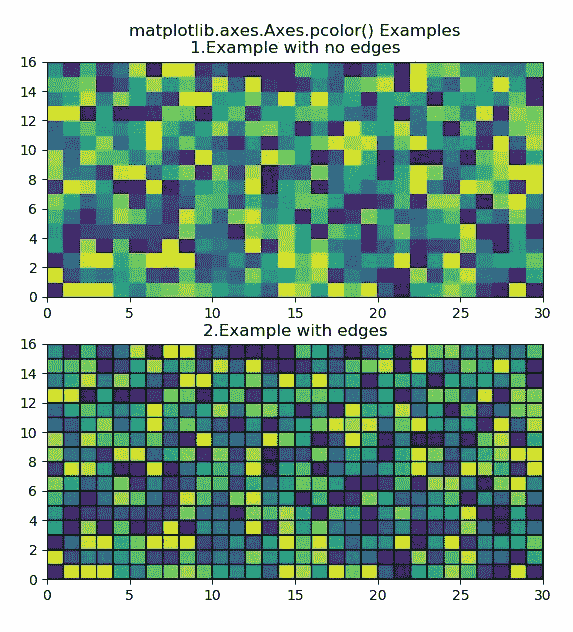

# python 中的 Matplotlib.axes.Axes.pcolor()

> 哎哎哎:# t0]https://www . geeksforgeeks . org/matplotlib-axes-pconlor-in-python/

**[Matplotlib](https://www.geeksforgeeks.org/python-introduction-matplotlib/)** 是 Python 中的一个库，是 NumPy 库的数值-数学扩展。**轴类**包含了大部分的图形元素:轴、刻度、线二维、文本、多边形等。，并设置坐标系。Axes 的实例通过回调属性支持回调。

## matplotlib.axes.Axes.pcolor()函数

matplotlib 库的 Axes 模块中的 **Axes.pcolor()函数**也用于创建具有非规则矩形网格的伪彩色图

> **语法:** Axes.pcolor(self，*args，alpha=None，norm=None，cmap=None，vmin=None，vmax=None，data=None，**kwargs)
> **pcolor([X，Y，] C，**kwargs)**
> 
> **参数:**该方法接受以下描述的参数:
> 
> *   **C :** 此参数包含 2D 阵列中要进行颜色映射的值。
> *   **X，Y:** 这些参数是四边形角的坐标。
> *   **cmap :** 此参数是一个 colormap 实例或注册的 colormap 名称。
> *   **norm :** 此参数是 Normalize 实例，它将数据值缩放到标准颜色映射范围[0，1]，以映射到颜色
> *   **vmin，vmax :** 这些参数本质上是可选，它们是 colorbar 范围。
> *   **边缘颜色:**该参数是边缘的颜色。{ '无'，无，'脸'，颜色，颜色序列}
> *   **alpha :** 此参数是颜色的强度。
> *   **捕捉:**此参数用于将网格捕捉到像素边界。
> 
> **返回:**这返回**集合**。

下面的例子说明了 matplotlib.axes.Axes.pcolor()函数在 matplotlib.axes 中的作用:

**示例-1:**

```py
# Implementation of matplotlib function
import matplotlib.pyplot as plt
import numpy as np
from matplotlib.colors import LogNorm

Z = np.random.rand(6, 30)

fig, ax0 = plt.subplots()

ax0.pcolor(Z)

ax0.set_title('matplotlib.axes.Axes.pcolor() Examples')
plt.show()
```

**输出:**


**示例-2:**

```py
# Implementation of matplotlib function
import matplotlib.pyplot as plt
import numpy as np
from matplotlib.colors import LogNorm

Z = np.random.rand(16, 30)

fig, (ax0, ax1) = plt.subplots(2, 1)

c = ax0.pcolor(Z)

c = ax1.pcolor(Z, edgecolors ='k', linewidths = 1)
ax1.set_title('2.Example with edges')

ax0.set_title('matplotlib.axes.Axes.pcolor() \
Examples\n1.Example with no edges')
plt.show()
```

**输出:**
