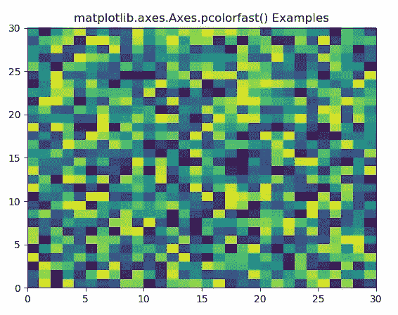
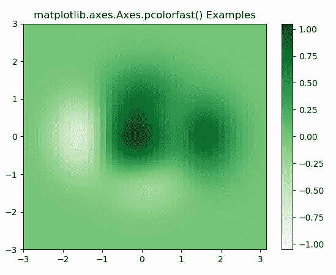

# matplotlib . axes . pconlorfast()用 Python

表示

> 哎哎哎:# t0]https://www . geeksforgeeks . org/matplotlib-axes-pcolorfast-in-python/

**[Matplotlib](https://www.geeksforgeeks.org/python-introduction-matplotlib/)** 是 Python 中的一个库，是 NumPy 库的数值-数学扩展。**轴类**包含了大部分的图形元素:轴、刻度、线二维、文本、多边形等。，并设置坐标系。Axes 的实例通过回调属性支持回调。

## matplotlib . axes . axes . pconlorfast()函数

matplotlib 库的 Axes 模块中的 **Axes.pcolorfast()函数**也用于创建具有非规则矩形网格的伪彩色图。它有一些限制:只支持平面着色，缺少对数缩放和 pyplot 包装。

> **语法:** Axes.pcolorfast(self、*args、alpha=None、norm=None、cmap=None、vmin=None、vmax=None、data=None、**kwargs)
> T3】pcolorfast([x，y，] C、* * kwargs)】
> 
> **参数:**该方法接受以下描述的参数:
> 
> *   **C :** 此参数包含 2D 阵列中要进行颜色映射的值。
> *   **X，Y:** 这些参数是四边形角的坐标。
> *   **cmap :** 此参数是一个 colormap 实例或注册的 colormap 名称。
> *   **norm :** 此参数是 Normalize 实例，它将数据值缩放到标准颜色映射范围[0，1]，以映射到颜色
> *   **vmin，vmax :** 这些参数本质上是可选，它们是 colorbar 范围。
> *   **alpha :** 此参数是颜色的强度。
> *   **捕捉:**此参数用于将网格捕捉到像素边界。
> 
> **返回:**这将返回以下内容:
> 
> *   **图像:**这将返回依赖于**轴图像**、**多边形图像**和**四边形网格**的图像。

下面的例子说明了 matplotlib.axes . axes . pcolorfast()函数在 matplotlib . axes 中的作用:

**示例-1:**

```py
# Implementation of matplotlib function
import matplotlib.pyplot as plt
import numpy as np
from matplotlib.colors import LogNorm

Z = np.random.rand(30, 30)

fig, ax0 = plt.subplots()

ax0.pcolorfast(Z)

ax0.set_title('matplotlib.axes.Axes.pcolorfast() Examples')
plt.show()
```

**输出:**


**示例-2:**

```py
# Implementation of matplotlib function
import matplotlib.pyplot as plt
import numpy as np
from matplotlib.colors import LogNorm

dx, dy = 0.15, 0.05
y, x = np.mgrid[slice(-3, 3 + dy, dy), slice(-3, 3 + dx, dx)]
z = (1 - x / 2\. + x ** 5 + y ** 3) * np.exp(-x ** 2 - y ** 2)

z = z[:-1, :-1]
z_min, z_max = -np.abs(z).max(), np.abs(z).max()

fig, ax = plt.subplots()

c = ax.pcolorfast(x, y, z, cmap ='Greens', vmin = z_min, vmax = z_max)
fig.colorbar(c, ax = ax)

ax.set_title('matplotlib.axes.Axes.pcolorfast() Examples')
plt.show()
```

**输出:**
