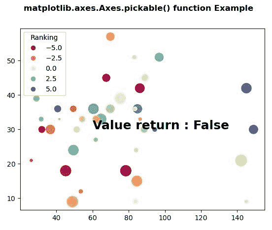
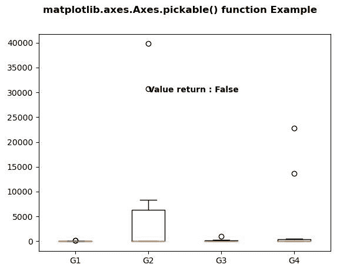

# matplot lib . axes . axes . pick able()用 Python

表示

> 原文:[https://www . geesforgeks . org/matplotlib-axes-axes-python 中的可拾取/](https://www.geeksforgeeks.org/matplotlib-axes-axes-pickable-in-python/)

**[Matplotlib](https://www.geeksforgeeks.org/python-introduction-matplotlib/)** 是 Python 中的一个库，是 NumPy 库的数值-数学扩展。**轴类**包含了大部分的图形元素:轴、刻度、线二维、文本、多边形等。，并设置坐标系。Axes 的实例通过回调属性支持回调。

## matplotlib.axes.Axes.pickable()函数

matplotlib 库的 Axes 模块中的 **Axes.pickable()函数**用于返回艺术家是否可 pick。

> **语法:**轴.可拾取(自)
> 
> **参数:**此方法不接受任何参数。
> 
> **返回:**此方法返回艺术家是否可挑。

下面的例子说明了 matplotlib.axes.Axes.pickable()函数在 matplotlib.axes 中的作用:

**例 1:**

```py
# Implementation of matplotlib function
import numpy as np
np.random.seed(19680801)
import matplotlib.pyplot as plt

volume = np.random.rayleigh(27, size = 40)
amount = np.random.poisson(10, size = 40)
ranking = np.random.normal(size = 40)
price = np.random.uniform(1, 10, size = 40)

fig, ax = plt.subplots()

scatter = ax.scatter(volume * 2, amount * 3,
                     c = ranking * 3, 
                     s = 0.3*(price * 3)**2,
                     vmin = -4, vmax = 4, 
                     cmap = "Spectral")

legend1 = ax.legend(*scatter.legend_elements(num = 5),
                    loc ="upper left",
                    title ="Ranking")

ax.add_artist(legend1)

ax.text(60, 30, "Value return : " + str(ax.pickable()), 
        fontweight ="bold", 
        fontsize = 18)

fig.suptitle('matplotlib.axes.Axes.pickable() function\
Example', fontweight ="bold")

plt.show()
```

**输出:**


**例 2:**

```py
import numpy as np
import matplotlib.pyplot as plt
import matplotlib.cbook as cbook

np.random.seed(10**7)
data = np.random.lognormal(size =(10, 4),
                           mean = 4.5,
                           sigma = 4.75)

labels = ['G1', 'G2', 'G3', 'G4']

result = cbook.boxplot_stats(data, 
                             labels = labels, 
                             bootstrap = 1000)

for n in range(len(result)):
    result[n]['med'] = np.median(data)
    result[n]['mean'] *= 0.1

fig, axes1 = plt.subplots()
axes1.bxp(result)

axes1.text(2, 30000,
           "Value return : " + str(axes1.pickable()), 
           fontweight ="bold")

fig.suptitle('matplotlib.axes.Axes.pickable() function \
Example', fontweight ="bold")

plt.show()
```

**输出:**
