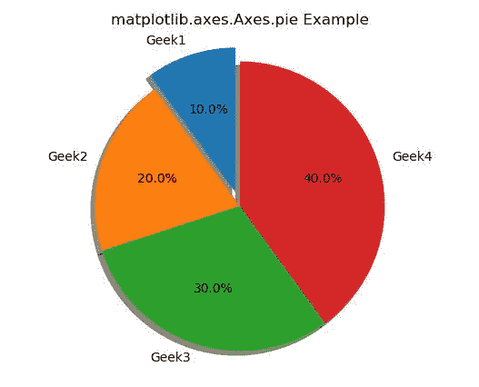
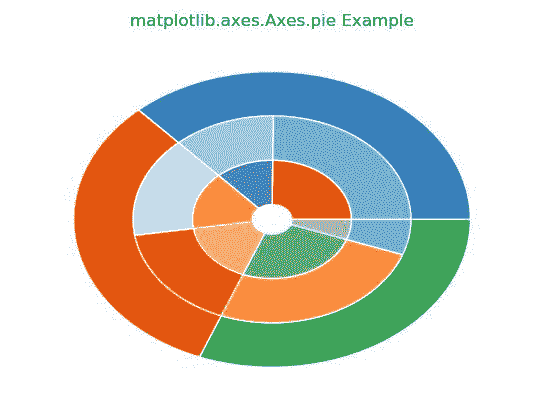

# Python 中的 matplotlib.axes.Axes.pie()

> 原文:[https://www . geeksforgeeks . org/matplotlib-axes-axes-pie-in-python/](https://www.geeksforgeeks.org/matplotlib-axes-axes-pie-in-python/)

**[Matplotlib](https://www.geeksforgeeks.org/python-introduction-matplotlib/)** 是 Python 中的一个库，是 NumPy 库的数值-数学扩展。**轴类**包含了大部分的图形元素:轴、刻度、线二维、文本、多边形等。，并设置坐标系。Axes 的实例通过回调属性支持回调。

## matplotlib . axes . axes()函数

matplotlib 库的 Axes 模块中的 **Axes.pie()函数**用于绘制饼图。

> **语法:** Axes.pie(self，x，explode = None，labels=None，colors=None，autopct = None，pctdistance=0.6，shadow=False，labeldistance=1.1，startangle=None，radius=None，counterclock = True，wedgeprops=None，textprops=None，center=(0，0)，frame=False，rotatelabels=False，*，data=None)
> 
> **参数:**该方法接受以下描述的参数:
> 
> *   **x:** 该参数为楔形尺寸。
> *   **分解:**该参数是一个透镜(x)阵列，它指定偏移每个楔形的半径分数。
> *   **自动计算:**该参数是一个字符串或函数，用于用数值标记楔形区。
> *   **颜色:**该参数是饼图将循环通过的 matplotlib 颜色参数序列。
> *   **标签:**该参数是为每个楔形提供标签的字符串序列。
> *   **pctdistance:** 此参数是每个饼图切片的中心与自动切割生成的文本的开始之间的比率。
> *   **阴影:**这个参数是用来在馅饼下面画阴影的。
> *   **标签位置:**此参数是绘制饼图标签的径向距离。
> *   **起始角度:**此参数用于将饼图的起始位置从 x 轴逆时针旋转角度度。
> *   **半径:**此参数为饼图的半径。
> *   **反锁:**该参数指定分数方向，顺时针或逆时针。
> *   **楔形块:**该参数是传递给构成饼图的楔形对象的参数集合。
> *   **textprops:** 此参数是要传递给文本对象的参数集合。
> *   **中心:**此参数为图表的中心位置。
> *   **框架:**如果为真，该参数用于绘制图表的坐标轴框架。
> *   **旋转标签:**如果为真，该参数用于将每个标签旋转到相应切片的角度。
> 
> **返回:**这将返回以下内容:
> 
> *   **面片:**返回 matplotlib.patches.Wedge 实例的序列。
> *   **texts:** 返回标签 matplotlib.text.Text 实例的列表。
> *   **自动文本:**返回数字标签的文本实例列表。

下面的例子说明了 matplotlib.axes.Axes.pie()函数在 matplotlib.axes 中的作用:

**示例#1:**

```py
# Implementation of matplotlib function
import matplotlib.pyplot as plt

labels = 'Geek1', 'Geek2', 'Geek3', 'Geek4'
sizes = [10, 20, 30, 40]
explode = (0.1, 0, 0, 0)

fig1, ax1 = plt.subplots()
ax1.pie(sizes, explode = explode,
        labels = labels, autopct ='% 1.1f %%',
        shadow = True, startangle = 90)
ax1.axis('equal')

ax1.set_title('matplotlib.axes.Axes.pie Example')
plt.show()
```

**输出:**


**例 2:**

```py
# Implementation of matplotlib function
import matplotlib.pyplot as plt
import numpy as np

fig, ax = plt.subplots()

size = 0.3
vals = np.array([[90, 43], [57, 60],
                 [92, 20]])

cmap = plt.get_cmap("tab20c")
outer_colors = cmap(np.arange(3)*4)
mid_colors = cmap(np.array([1, 2, 3, 4, 5, ]))
inner_colors = cmap(np.array([4, 12, 5, 
                              6, 9, 10]))

ax.pie(vals.sum(axis = 1), radius = 1, 
       colors = outer_colors,
       wedgeprops = dict(width = size, 
                         edgecolor ='w'))

ax.pie(vals.flatten(), radius = 1-size, 
       colors = mid_colors,
       wedgeprops = dict(width = size,
                         edgecolor ='w'))

ax.pie(vals.flatten(), radius = 1-2 * size,
       colors = inner_colors,
       wedgeprops = dict(width = size, 
                         edgecolor ='w'))

ax.set_title('matplotlib.axes.Axes.pie Example')
plt.show()
```

