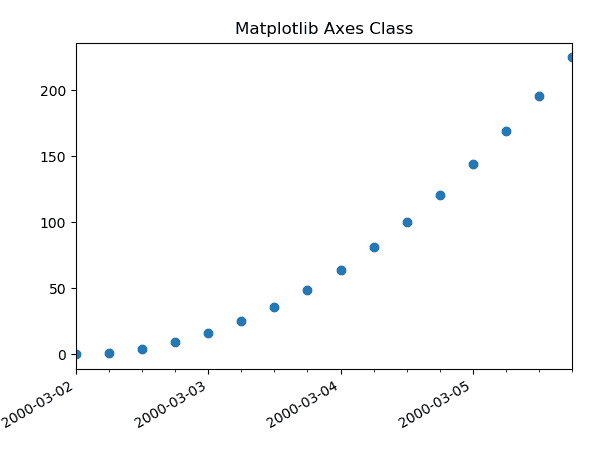
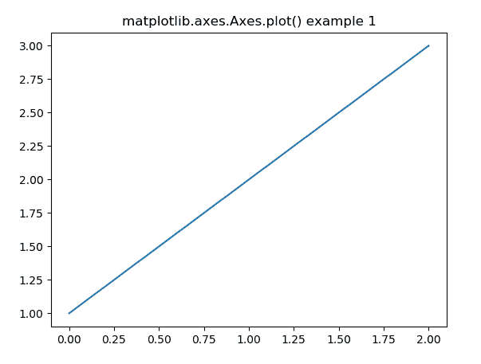
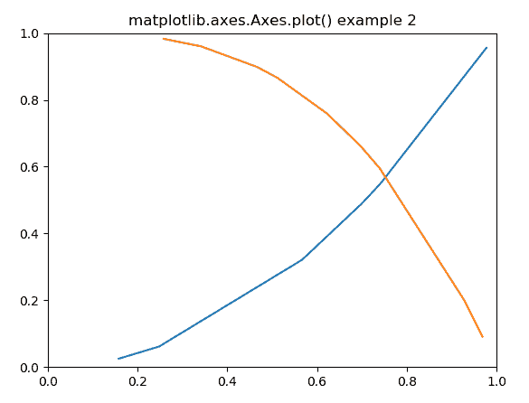

# matplotlib . axes . plot()用 Python

表示

> 哎哎哎:# t0]https://www . geeksforgeeks . org/matplot lib-axes-plot-in-python/

**[Matplotlib](https://www.geeksforgeeks.org/python-introduction-matplotlib/)** 是 Python 中的一个库，是 NumPy 库的数值-数学扩展。

**轴类**包含大部分图形元素:轴、刻度、线 2D、文本、多边形等。，并设置坐标系。Axes 的实例通过回调属性支持回调。
T3】例:

```
import datetime
import matplotlib.pyplot as plt
from matplotlib.dates import DayLocator, HourLocator, DateFormatter, drange
import numpy as np

date1 = datetime.datetime(2000, 3, 2)
date2 = datetime.datetime(2000, 3, 6)
delta = datetime.timedelta(hours = 6)
dates = drange(date1, date2, delta)

y = np.arange(len(dates))

fig, ax = plt.subplots()
ax.plot_date(dates, y ** 2)

ax.set_xlim(dates[0], dates[-1])

ax.xaxis.set_major_locator(DayLocator())
ax.xaxis.set_minor_locator(HourLocator(range(0, 25, 6)))
ax.xaxis.set_major_formatter(DateFormatter('% Y-% m-% d'))

ax.fmt_xdata = DateFormatter('% Y-% m-% d % H:% M:% S')
fig.autofmt_xdate()

plt.title("Matplotlib Axes Class Example")
plt.show()
```

**输出:**


## matplotlib.axes.Axes.plot()函数

matplotlib 库的 Axes 模块中的 **Axes.plot()函数**用于绘制 y 对 x 作为线和/或标记。

> **语法:** Axes.plot(self，*args，scalex=True，scaley=True，data=None，**kwargs)
> 
> **参数:**该方法接受以下描述的参数:
> 
> *   **x，y:** 这些参数是数据点的水平和垂直坐标。x 值是可选的。
> *   **fmt:** 该参数为可选参数，包含字符串值。
> *   **数据:**该参数为可选参数，是一个带有标签数据的对象。
> 
> **返回:**这将返回以下内容:
> 
> *   **线:**这将返回表示打印数据的线 2D 对象列表。

下面的例子说明了 matplotlib.axes.Axes.plot()函数在 matplotlib.axes 中的作用:

**示例#1:**

```
# Implementation of matplotlib function

import matplotlib.pyplot as plt
import numpy as np

# make an agg figure
fig, ax = plt.subplots()
ax.plot([1, 2, 3])
ax.set_title('matplotlib.axes.Axes.plot() example 1')
fig.canvas.draw()
plt.show()
```

**输出:**


**例 2:**

```
# Implementation of matplotlib function

import matplotlib.pyplot as plt
import numpy as np

# Fixing random state for reproducibility
np.random.seed(19680801)

# create random data
xdata = np.random.random([2, 10])

# split the data into two parts
xdata1 = xdata[0, :]
xdata2 = xdata[1, :]

# sort the data so it makes clean curves
xdata1.sort()
xdata2.sort()

# create some y data points
ydata1 = xdata1 ** 2
ydata2 = 1 - xdata2 ** 3

# plot the data
fig = plt.figure()
ax = fig.add_subplot(1, 1, 1)
ax.plot(xdata1, ydata1, color ='tab:blue')
ax.plot(xdata2, ydata2, color ='tab:orange')

# set the limits
ax.set_xlim([0, 1])
ax.set_ylim([0, 1])

ax.set_title('matplotlib.axes.Axes.plot() example 2')

# display the plot
plt.show()
```

**输出:**
