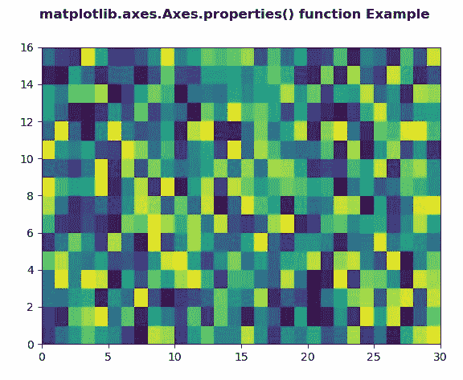
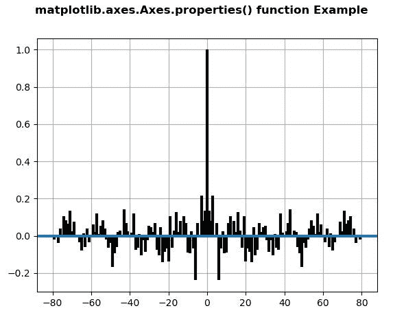

# Python 中的 matplotlib . axes . axes . properties()

> 原文:[https://www . geeksforgeeks . org/matplotlib-axes-axes-properties-in-python/](https://www.geeksforgeeks.org/matplotlib-axes-axes-properties-in-python/)

**[Matplotlib](https://www.geeksforgeeks.org/python-introduction-matplotlib/)** 是 Python 中的一个库，是 NumPy 库的数值-数学扩展。**轴类**包含了大部分的图形元素:轴、刻度、线二维、文本、多边形等。，并设置坐标系。Axes 的实例通过回调属性支持回调。

## matplotlib . axes . axes . properties()函数

matplotlib 库的 Axes 模块中的 **Axes.properties()函数**用于获取艺术家所有属性的字典..

> **语法:**轴.属性(自身)
> 
> **参数:**该方法不接受任何参数。
> 
> **返回:**此方法返回艺术家所有属性的字典。

下面的例子说明了 matplotlib.axes . axes . properties()函数在 matplotlib . axes 中的作用:

**例 1:**

```py
# Implementation of matplotlib function 
import numpy as np 
import matplotlib.pyplot as plt 

xx = np.random.rand(16, 30) 

fig, ax = plt.subplots() 

m = ax.pcolor(xx) 
m.set_zorder(-20)

w = ax.properties()
print("Display all Properties\n")
for i in w:
    print(i, ":", w[i])

fig.suptitle('matplotlib.axes.Axes.properties()\
 function Example', fontweight ="bold") 

plt.show() 
```

**输出:**



> 显示所有属性
> 
> 可调:框
> agg _ filter:None
> alpha:None
> 锚点:C
> 动画:False
> 方面:auto
> autoscale _ on:True
> autoscale _ on:True
> autoscale _ on:True
> axes _ locator:None
> axis below:line
> 子级:[，，，，，，，Text(0.5，1.0″)，Text(0.0，1.0″)，Text(1.0，1.0″) Text(0.5，1.0″)，Text(0.0，1.0″)，Text(1.0，1.0″)，]
> facecolor : (1.0，1.0，1.0，1.0)
> fc : (1.0，1.0，1.0，1.0)
> 图:图(640×480)
> frame_on : True
> 几何:(1，1，1)
> GID:None【T20 [])
> 行:< a >
> 导航:真
> 导航 _ 模式:无
> 路径 _ 效果:【】
> 拾取器:无
> 位置:Bbox(x0=0.125，y0=0.10999999999999，x1=0.9，y1=0.88)
> 光栅化 _zorder:无
> 光栅化:无【T39 无)
> 网址:无
> 可见:真
> 窗口 _ 范围:transformed box(
> Bbox(x0 = 0.125，y0=0.109999999999，x1=0.9，y1=0.88)
> Bbox transform to(
> transformed box(
> Bbox(x0 = 0.0，y0=0.0，x1=6.4，y1 = 0) 0.0.】
> 【0。100.0.】
> 【0。0.1.])))))
> XAxis:XAxis(80.0，52.8)
> XAxis _ transform:blended generictransform(
> CompositeGenericTransform(
> transform wrapper(
> blended affinite2d(
> identity transform()，
> IdentityTransform()))))，
> CompositeGenericTransform(
> BboxTransformFrom(
> transformed dbox(
> transformed box0.0.】
> 【0。100.0.】
> 【0。0.1.]))))))，
> Bbox transformto(
> transformed box(
> Bbox(x0 = 0.125，y0=0.1099999999999，x1=0.9，y1=0.88)，
> Bbox transformto(
> transformed box(
> Bbox(x0 = 0.0，y0=0.0，x1=6.4，y1=40.0.】
> 【0。100.0.】
> 【0。0.1.])))))))
> xbound:(0.0，30.0)
> xgridlines:<a>
> xlabel:
> xlim:(0.0，30.0)
> xmajorticklabels:<a>
> xminoticlabels:<a>
> xscale:linear
> xticklabels:】5.10.15.20.25.30.】
> yaxis : YAxis(80.0，52.8)
> YAxis _ transform:blendgenerictransform(
> BboxTransformTo(
> transformed box(
> Bbox(x0 = 0.125，y0=0.10999999999999，x1=0.9，y1 = 0.88)
> BboxTransformTo(
> transformed box(【T1090.0.】
> 【0。100.0.】
> 【0。0.1.]])))))，
> CompositeGenericTransform(
> TransformWrapper(
> blended affinite2d(
> identity transform()，
> IdentityTransform()))))，
> CompositeGenericTransform(
> Bbox transformfrom(
> transformed Bbox(
> Bbox(x0 = 0.0，y0=0.0，x1=30.0，y1=16。0.0.】
> 【0。100.0.】
> 【0。0.1.])))))))
> ybound:(0.0，16.0)
> ygridlines:<a>
> ylabel:
> ylim:(0.0，16.0)
> ymjorticklabels:<a>T142】yminoticlabels:<a>T143】yscale:linear
> yti2.4.6.8.10.12.14.16.】
> zorder : 0

**例 2:**

```py
# Implementation of matplotlib function
import matplotlib.pyplot as plt
import numpy as np

np.random.seed(10**7)
geeks = np.random.randn(100)

fig, ax = plt.subplots()
ax.acorr(geeks, usevlines = True,
         normed = True,
         maxlags = 80, lw = 3)

ax.grid(True)

w = ax.properties()
print("Display all Properties\n")
for i in w:
    print(i, ":", w[i])

fig.suptitle('matplotlib.axes.Axes.properties()\
function Example', fontweight ="bold") 

plt.show() 
```

**输出:**



> 显示所有属性
> 
> 可调:框
> agg _ filter:None
> alpha:None
> 锚点:C
> 动画:False
> 方面:auto
> autoscale _ on:True
> autoscale _ on:True
> autoscale _ on:True
> axes _ locator:None
> axis below:line
> 子级:[，，，，，，，，Text(0.5，1.0″)，Text(0.0，1.0″)，Text(1.0，1.0″) Text(0.5，1.0″)，Text(0.0，1.0″)，Text(1.0，1.0″)，]
> facecolor : (1.0，1.0，1.0，1.0)
> fc : (1.0，1.0，1.0，1.0)
> 图:图(640×480)
> frame_on : True
> 几何:(1，1，1)
> GID:None【T20 [])
> 行:< a >
> 导航:真
> 导航 _ 模式:无
> 路径 _ 效果:【】
> 拾取器:无
> 位置:Bbox(x0=0.125，y0=0.10999999999999，x1=0.9，y1=0.88)
> 光栅化 _zorder:无
> 光栅化:无【T39 无)
> 网址:无
> 可见:真
> 窗口 _ 范围:transformed box(
> Bbox(x0 = 0.125，y0=0.109999999999，x1=0.9，y1=0.88)
> Bbox transform to(
> transformed box(
> Bbox(x0 = 0.0，y0=0.0，x1=6.4，y1 = 0) 0.0.】
> 【0。100.0.】
> 【0。0.1.])))))
> XAxis:XAxis(80.0，52.8)
> XAxis _ transform:blended generictransform(
> CompositeGenericTransform(
> transform wrapper(
> blended affinite2d(
> identity transform()，
> IdentityTransform()))))，
> CompositeGenericTransform(
> BboxTransformFrom(
> transformed dbox(
> transformed box0.0.】
> 【0。100.0.】
> 【0。0.1.]))))))，
> Bbox transformto(
> transformed box(
> Bbox(x0 = 0.125，y0=0.1099999999999，x1=0.9，y1=0.88)，
> Bbox transformto(
> transformed box(
> Bbox(x0 = 0.0，y0=0.0，x1=6.4，y1=40.0.】
> 【0。100.0.】
> 【0。0.1.]))))))
> xd bound:(-88.0，88.0)
> xd grill:<a>
> XL Abel:
> xlim:(-88.0，88.0)
> xmajorticklabels:<a>
> xminotick labels:<a>
> xscale:linear
> XT-80.-60.-40.-20.0.20.40.60.80.100.】
> yaxis : YAxis(80.0，52.8)
> YAxis _ transform:blendgenerictransform(
> BboxTransformTo(
> transformed box(
> Bbox(x0 = 0.125，y0=0.10999999999999，x1=0.9，y1 = 0.88)
> BboxTransformTo(
> transformed box(【T1090.0.】
> 【0。100.0.】
> 【0。0.1.])))))，
> CompositeGenericTransform(
> TransformWrapper(
> blended affinite2d(
> identity transform()，
> IdentityTransform()))))，
> CompositeGenericTransform(
> Bbox transformfrom(
> transformed dbbox(
> Bbox(x0 =-88.0，y0 =-0.30060532663330.0.】
> 【0。100.0.】
> 【0。0.1.])))))))
> ybound:(-0.300605326634452，1.061933586982593)】
> ygridline:<a>
> ylabel:
> ylim:(-0.30060636642，1.3006066060.2 0.4 0.6 0.8 1.1.2]
> zorder : 0