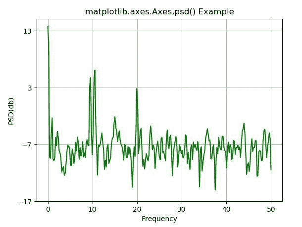

# matplotlib . axes . PSD()中的 Python

> 哎哎哎:# t0]https://www . geeksforgeeks . org/matplot lib-axes-PSD-in-python/

**[Matplotlib](https://www.geeksforgeeks.org/python-introduction-matplotlib/)** 是 Python 中的一个库，是 NumPy 库的数值-数学扩展。**轴类**包含了大部分的图形元素:轴、刻度、线二维、文本、多边形等。，并设置坐标系。Axes 的实例通过回调属性支持回调。

## matplotlib.axes.Axes.psd()函数

matplotlib 库的 Axes 模块中的 **Axes.psd()函数**用于绘制功率谱密度。

> **语法:** Axes.psd(self，x，NFFT =无，Fs =无，Fc =无，detrend =无，window =无，noverlap =无，pad _ to =无，sides =无，scale _ by _ freq =无，return _ line =无，* data =无，* * * kwargs)
> 
> **参数:**该方法接受以下描述的参数:
> 
> *   **x:** 这个参数是一个数据序列。
> *   **Fs :** 此参数为标量。它的默认值是 2。
> *   **窗口:**该参数以一个数据段为自变量，返回该段的窗口版本。其默认值为 *window_hanning()*
> *   **边:**此参数指定要返回光谱的哪些边。这可以有以下值:“默认值”、“单侧”和“双侧”。
> *   **pad_to :** 此参数包含数据段填充到的整数值。
> *   **NFFT :** 该参数包含用于快速傅立叶变换的每个块中的数据点数。
> *   **去趋势:**此参数包含在 fft 之前应用于每个分段的函数，旨在移除均值或线性趋势{ '无'，'均值'，'线性' }。
> *   **scale_by_freq :** 该参数允许对返回的频率值进行积分。
> *   **noverlap :** 此参数是块之间重叠的点数。
> *   **Fc :** 该参数为 x 的中心频率。
> *   **return_line :** 此参数包括在返回值中绘制的线对象。
> 
> **返回:**这将返回以下内容:
> 
> *   **Pxx:** 这将返回缩放前功率谱 P_{xx}的值。
> *   **频率:**返回 Pxx 中元素的频率。
> *   **行:**返回该函数创建的行。
> 
> 结果是 **(Pxx，freqs，line)**

下面的例子说明了 matplotlib.axes.Axes.csd()函数在 matplotlib.axes 中的作用:

**示例-1:**

```
# Implementation of matplotlib function
import numpy as np
import matplotlib.pyplot as plt

dt = 0.01
t = np.arange(0, 30, dt)
nse1 = np.random.randn(len(t))

s1 = 1.5 * np.sin(2 * np.pi * 10 * t) + nse1 + np.cos(np.pi * t)

fig, ax1 = plt.subplots()
ax1.psd(s1**2, 512, 1./dt, color ="green")
ax1.set_xlabel('Frequency')
ax1.set_ylabel('PSD(db)')

ax1.set_title('matplotlib.axes.Axes.psd() Example')
plt.show()
```

**输出:**


**示例-2:**

```
# Implementation of matplotlib function
import numpy as np
import matplotlib.pyplot as plt

dt = 0.01
t = np.arange(0, 30, dt)
nse1 = np.random.randn(len(t))
r = np.exp(-t / 0.05)

cnse1 = np.convolve(nse1, r, mode ='same')*dt

s1 = np.cos(np.pi * t) + cnse1 + np.sin(2 * np.pi * 10 * t) 

fig, [ax1, ax2] = plt.subplots(2, 1)
ax1.plot(t, s1)
ax1.set_xlim(0, 5)
ax1.set_ylabel('value s1')
ax1.grid(True)

ax2.psd(s1, 256, 1./dt)
ax2.set_ylabel('PSD(db)')
ax2.set_xlabel('Frequency')

ax1.set_title('matplotlib.axes.Axes.psd() Example')
plt.show()
```

**输出:**
