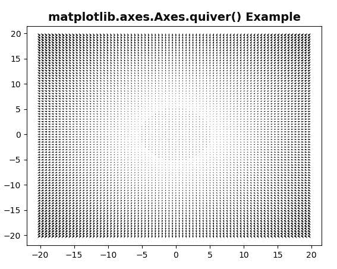
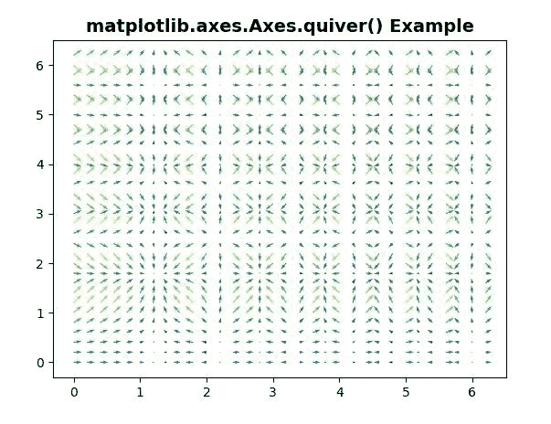

# Python 中的 Matplotlib.axes.Axes .箭袋()

> 原文:[https://www . geeksforgeeks . org/matplotlib-axes-axes-wing-in-python/](https://www.geeksforgeeks.org/matplotlib-axes-axes-quiver-in-python/)

**[Matplotlib](https://www.geeksforgeeks.org/python-introduction-matplotlib/)** 是 Python 中的一个库，是 NumPy 库的数值-数学扩展。**轴类**包含了大部分的图形元素:轴、刻度、线二维、文本、多边形等。，并设置坐标系。Axes 的实例通过回调属性支持回调。

## matplotlib.axes.Axes .箭袋()函数

matplotlib 库的 Axes 模块中的 **Axes.barbs()函数**也用于绘制箭头的 2D 场。

> **语法:** Axes .颤颤(self，*args，data=None，**kw
> 
> **参数:**该方法接受以下描述的参数:
> 
> *   **X，Y :** 这些参数是箭头位置的 X 和 Y 坐标。
> *   **U，V:** 这些参数是箭头向量的 x 和 y 分量。
> *   **C :** 该参数包含通过 norm 和 cmap 通过颜色映射定义箭头颜色的数字数据。
> *   **枢轴:**此参数是箭头锚定到 X，Y 网格的部分。
> *   **单位:**此参数为箭头尺寸(长度除外)以该单位的倍数测量。
> *   **角度:**该参数是确定箭头角度的方法。
> *   **刻度:**此参数为每个箭头长度单位的数据单位数。
> *   **scale_units :** 此参数为可选参数，它包含以下值*‘宽度’、‘高度’、‘点’、‘英寸’、‘x’、‘y’、‘xy’*。
> *   **宽度:**此参数为轴宽，单位为箭头。
> *   **首端:**该参数为轴宽倍数的头部宽度。
> *   **轴头长度:**该参数为轴宽倍数的长宽。
> *   **首端:**该参数为轴宽倍数的头部宽度。
> *   **轴头长度:**此参数为轴交点处的轴头长度。
> *   **主轴:**该参数是箭头刻度以下的长度，以头部长度为单位。
> *   **最小长度:**该参数是轴宽倍数的最小长度。
> *   **颜色:**该参数是箭头的显式颜色。

以下示例说明了 matplotlib.axes.Axes .箭袋()函数在 matplotlib.axes 中的作用:

**例 1:**

```py
# Implementation of matplotlib function
import matplotlib.pyplot as plt
import numpy as np

X = np.arange(-20, 20, 0.5)
Y = np.arange(-20, 20, 0.5)
U, V = np.meshgrid(X, Y)

fig, ax = plt.subplots()
q = ax.quiver(X, Y, U, V)

ax.set_title('matplotlib.axes.Axes.quiver()\
 Example', fontsize = 14, fontweight ='bold')
plt.show()
```

**输出:**


**例 2:**

```py
# Implementation of matplotlib function
import matplotlib.pyplot as plt
import numpy as np

X, Y = np.meshgrid(np.arange(0, 2 * np.pi, .2), 
                   np.arange(0, 2 * np.pi, .2))
U = np.cos(X**2)
V = np.sin(Y**2)
C = U**2 + V**2

fig, ax = plt.subplots()
ax.quiver(X, Y, U, V, C, units ='width')
ax.set_title('matplotlib.axes.Axes.quiver() \
Example', fontsize = 14, fontweight ='bold')
plt.show()
```

**输出:**
