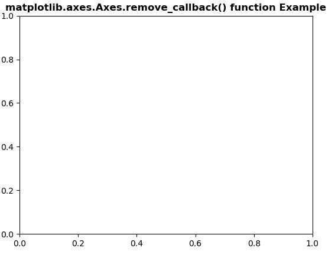
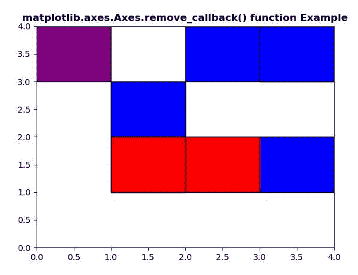

# Python 中的 matplotlib . axes . axes . remove _ callback()

> 原文:[https://www . geeksforgeeks . org/matplotlib-axes-axes-remove _ callback-in-python/](https://www.geeksforgeeks.org/matplotlib-axes-axes-remove_callback-in-python/)

**[Matplotlib](https://www.geeksforgeeks.org/python-introduction-matplotlib/)** 是 Python 中的一个库，是 NumPy 库的数值-数学扩展。**轴类**包含了大部分的图形元素:轴、刻度、线二维、文本、多边形等。，并设置坐标系。Axes 的实例通过回调属性支持回调。

## matplotlib . axes . axes . remove _ callback()方法

matplotlib 库的 axes 模块中的 **remove_callback()方法**用于根据观察器 id 移除回调。

> **语法:** Axes.remove_callback(self，oid)
> 
> **参数:**该方法接受以下参数。
> 
> *   **oid:** 这个参数是观察者 id
> 
> **返回:**该方法不返回值，

下面的例子说明了 matplotlib 中的 matplotlib . axes . axes . add _ callback()函数:

**例 1:**

```py
# Implementation of matplotlib function
import matplotlib.pyplot as plt
import numpy as np
import time

def update():
    plt.get_current_fig_manager().canvas.figure.patch.set_facecolor(str(np.random.random()))
    plt.draw()
    print("Draw at time :", time.time())

def start_animation():

    timer = fig.canvas.new_timer(interval = 50)
    w = timer.add_callback(update)
    timer.start()
    timer.remove_callback(w)

fig, ax = plt.subplots()
start_animation()

ax.set_title('matplotlib.axes.Axes.remove_callback() \
function Example', fontweight ="bold") 

plt.show()
```

**输出:**


**例 2:**

```py
# Implementation of matplotlib function  
from random import randint, choice 
import time 
import matplotlib.pyplot as plt 
import matplotlib.patches as mpatches 

back_color = "black"
colors = ['red', 'green', 'blue', 'purple'] 
width, height = 4, 4

fig, ax = plt.subplots() 
ax.set(xlim =[0, width], ylim =[0, height]) 

fig.canvas.draw()
ll = 1

def update():
    global ll
    x = randint(0, width - 1) 
    y = randint(0, height - 1) 

    arti = mpatches.Rectangle( 
        (x, y), 1, 1, 
        facecolor = choice(colors), 
        edgecolor = back_color 
    ) 

    ax.add_artist(arti)

    ax.draw_artist(arti) 

    fig.canvas.blit(ax.bbox) 
    print("Draw at time :", time.time())

    if ll > 10:
        timer.remove_callback(w)
    ll += 1

timer = fig.canvas.new_timer(interval = 1) 
w = timer.add_callback(update) 
timer.start()

ax.set_title('matplotlib.axes.Axes.remove_callback()\
function Example', fontweight ="bold") 

plt.show()
```

**输出:**


```py
Draw at time : 1588597900.000635
Draw at time : 1588597900.047566
Draw at time : 1588597900.0787704
Draw at time : 1588597900.11001
Draw at time : 1588597900.1412835
Draw at time : 1588597900.1725228
Draw at time : 1588597900.2037697
Draw at time : 1588597900.2350247
Draw at time : 1588597900.2662778
Draw at time : 1588597900.2975273
Draw at time : 1588597900.313137

```