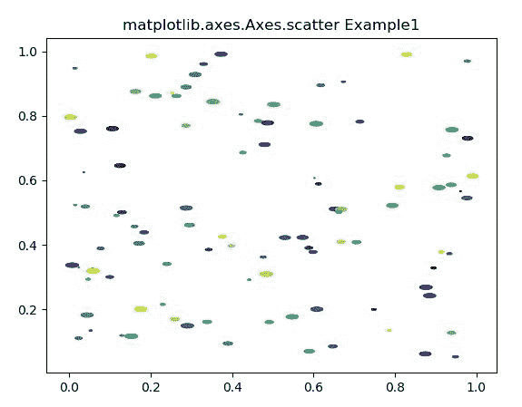
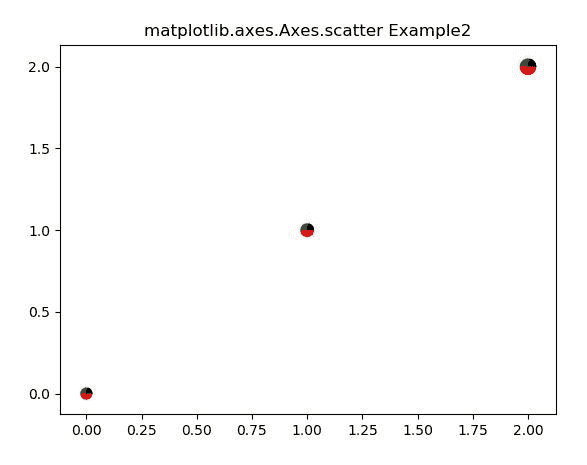

# Python 中的 Matplotlib.axes.Axes .散点()

> 原文:[https://www . geeksforgeeks . org/matplotlib-axes-axes-sparse-in-python/](https://www.geeksforgeeks.org/matplotlib-axes-axes-scatter-in-python/)

**[Matplotlib](https://www.geeksforgeeks.org/python-introduction-matplotlib/)** 是 Python 中的一个库，是 NumPy 库的数值-数学扩展。**轴类**包含了大部分的图形元素:轴、刻度、线二维、文本、多边形等。，并设置坐标系。Axes 的实例通过回调属性支持回调。

## matplotlib.axes.Axes .散点()函数

matplotlib 库的 Axes 模块中的 **Axes .散点图()函数**用于绘制不同标记大小和/或颜色的 y 对 x 散点图。

> **语法:** Axes.scatter(self，x，y，s=None，c=None，marker=None，cmap=None，norm=None，vmin=None，vmax=None，alpha=None，线宽=None，verts=，edgecolors=None，*，plotnonfinite = False，data=None，**kwargs)
> 
> **参数:**该方法接受以下描述的参数:
> 
> *   **x，y:** 这些参数是数据点的水平和垂直坐标。
> *   **s:** 该参数为可选参数，包含大小为点**2 的标记。
> *   **c:** 该参数为可选参数，包含颜色的顺序。
> *   **标记:**该参数也是可选参数。它包含标记样式。
> *   **cmap:** 该参数也是一个可选参数，包含注册的颜色映射名称。其默认值为*无*。
> *   **范数:**该参数也是可选参数。它用于将亮度数据缩放到 0，1。其默认值为*无*。
> *   **vmin，vmax:** 这些参数与 norm 一起使用，以默认值*无*归一化亮度数据。
> *   **α:**该参数也是可选参数。它们在 0(透明)和 1(不透明)之间混合值。
> *   **线宽:**该参数也是可选参数。这是标记边缘的线宽。其默认值为“无”。
> *   **edgecolors:** 该参数也是可选参数。它是颜色或{ '脸'，'无'，'无}的顺序。
> *   **plotafiniteboobin:**此参数也是可选参数。这是标记边缘的线宽。其默认值为“无”。
> 
> **返回:**返回容器，包括以下内容:
> 
> *   **绘图线:**这将返回 x，y 绘图标记和/或线的线 2D 实例。
> *   **caplines:** 这将返回误差线 caps 的 Line2D 实例的元组。
> *   **barlinecols:** 这将返回 LineCollection 的元组，包含水平和垂直误差范围。

下面的例子说明了 matplotlib.axes.Axes.errorbar()函数在 matplotlib.axes 中的作用:

**示例-1:**

```py
# Implementation of matplotlib function

import matplotlib.pyplot as plt
import numpy as np

# unit value1 ellipse
rx, ry = 3., 1.
value1 = rx * ry * np.pi
value2 = np.arange(0, 3 * np.pi + 0.01, 0.2)

value3 = np.column_stack([rx / value1 * np.cos(value2),
                          ry / value1 * np.sin(value2)])

x, y, s, c = np.random.rand(4, 99)
s *= 10**2.

fig, ax = plt.subplots()
ax.scatter(x, y, s, c, marker = value3)
ax.set_title("matplotlib.axes.Axes.scatter Example1")
plt.show()
```

**输出:**


**示例-2:**

```py
# Implementation of matplotlib function

import numpy as np
import matplotlib.pyplot as plt

# first define the ratios
r1 = 0.2
r2 = r1 + 0.3
r3 = r2 + 0.7

# define some sizes of the
# scatter marker
sizes = np.array([60, 80, 120, 50])

# calculate the points of the
# first pie marker
x1 = np.cos(2 * np.pi * np.linspace(0, r1))
y1 = np.sin(2 * np.pi * np.linspace(0, r1))

xy1 = np.row_stack([[0, 0],
                    np.column_stack([x1, y1])])

s1 = np.abs(xy1).max()

x2 = np.cos(2 * np.pi * np.linspace(r1, r2))
y2 = np.sin(2 * np.pi * np.linspace(r1, r2))

xy2 = np.row_stack([[0, 0], 
                    np.column_stack([x2, y2])])

s2 = np.abs(xy2).max()

x3 = np.cos(2 * np.pi * np.linspace(r2, r3))
y3 = np.sin(2 * np.pi * np.linspace(r2, r3))
xy3 = np.row_stack([[0, 0],
                    np.column_stack([x3, y3])])

s3 = np.abs(xy3).max()

x4 = np.cos(2 * np.pi * np.linspace(r3, 1))
y4 = np.sin(2 * np.pi * np.linspace(r3, 1))
xy4 = np.row_stack([[0, 0],
                    np.column_stack([x4, y4])])

s4 = np.abs(xy4).max()

fig, ax = plt.subplots()
ax.scatter(range(3), range(3),
           marker = xy1, s = s1**2 * sizes, 
           facecolor ='blue')

ax.scatter(range(3), range(3),
           marker = xy2, s = s2**2 * sizes,
           facecolor ='green')

ax.scatter(range(3), range(3),
           marker = xy3, s = s3**2 * sizes, 
           facecolor ='red')

ax.scatter(range(3), range(3),
           marker = xy4, s = s4**2 * sizes,
           facecolor ='black')

ax.set_title("matplotlib.axes.Axes.scatter Example2")
plt.show()
```

**输出:**
