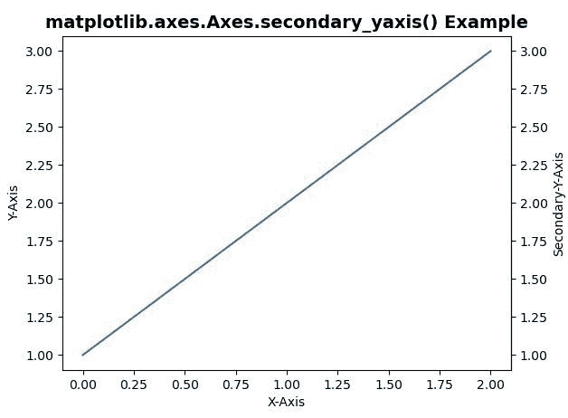
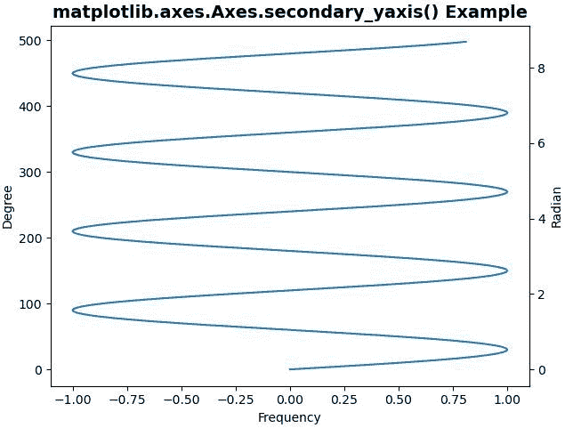

# Python 中的 matplotlib . axes . axes . secondary _ yaxis()

> 原文:[https://www . geeksforgeeks . org/matplotlib-axes-axes-secondary _ yaxis-in-python/](https://www.geeksforgeeks.org/matplotlib-axes-axes-secondary_yaxis-in-python/)

**[Matplotlib](https://www.geeksforgeeks.org/python-introduction-matplotlib/)** 是 Python 中的一个库，是 NumPy 库的数值-数学扩展。**轴类**包含了大部分的图形元素:轴、刻度、线二维、文本、多边形等。，并设置坐标系。Axes 的实例通过回调属性支持回调。

## matplotlib . axes . axes . secondary _ yaxis()函数

matplotlib 库的 Axes 模块中的 **Axes.secondary_yaxis()函数**也用于给该轴添加第二个 y 轴。

> **语法:** Axes.secondary_yaxis(self，location，* functions = None，**kwargs)
> 
> **参数:**该方法接受以下描述的参数:
> 
> *   **位置:**该参数是放置副轴的位置。
> *   **函数:**该参数用于指定变换函数及其逆函数。
> 
> **返回:**该方法返回以下内容:
> 
> *   **斧:**此回 ***斧。_ 副轴。**次级亚星*。

**注意:**该功能在 Matplotlib 版本>中工作= 3.1

下面的例子说明了 matplotlib.axes . axes . secondary _ xaxis()函数在 matplotlib . axes 中的作用:

**例 1:**

```py
# Implementation of matplotlib function
import matplotlib.pyplot as plt
import numpy as np

fig, ax = plt.subplots()
ax.plot([1, 2, 3])

ax.set_xlabel('X-Axis')
ax.set_ylabel('Y-Axis')

secax = ax.secondary_yaxis('right')
secax.set_ylabel('Secondary-Y-Axis')
ax.set_title('matplotlib.axes.Axes.secondary_yaxis() Example',
             fontsize = 14, fontweight ='bold')
plt.show()
```

**输出:**


**例 2:**

```py
# Implementation of matplotlib function
import matplotlib.pyplot as plt
import numpy as np
import datetime
import matplotlib.dates as mdates
from matplotlib.transforms import Transform
from matplotlib.ticker import (
    AutoLocator, AutoMinorLocator)

fig, ax = plt.subplots(constrained_layout = True)
x = np.arange(0, 500, 2)
y = np.sin(3 * x * np.pi / 180)
ax.plot(y, x)
ax.set_ylabel('Degree')
ax.set_xlabel('Frequency')

def val1(y):
    return y * np.pi / 180

def val2(y):
    return y * 180 / np.pi

secax = ax.secondary_yaxis('right', functions =(val1, val2))
secax.set_ylabel('Radian')
ax.set_title('matplotlib.axes.Axes.secondary_yaxis() Example',
             fontsize = 14, fontweight ='bold')
plt.show()
```

**输出:**
