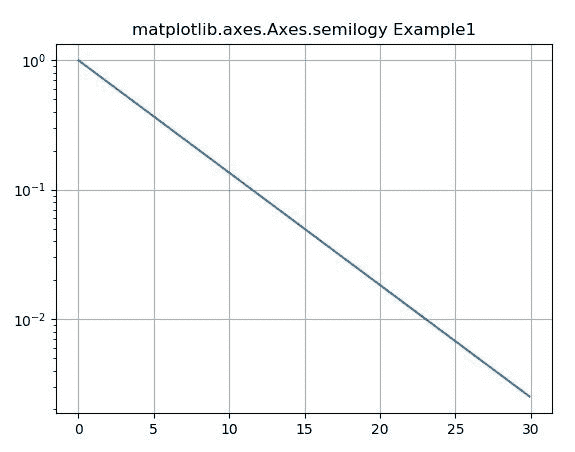
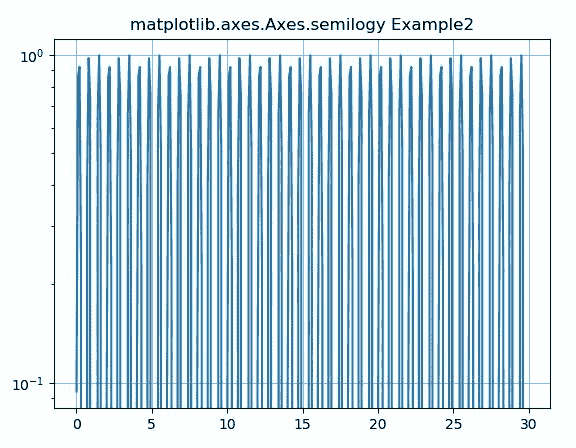

# Python 中的 matplotlib . axes . axes . semicology()

> 原文:[https://www . geeksforgeeks . org/matplotlib-axes-axes-semicology-in-python/](https://www.geeksforgeeks.org/matplotlib-axes-axes-semilogy-in-python/)

**[Matplotlib](https://www.geeksforgeeks.org/python-introduction-matplotlib/)** 是 Python 中的一个库，是 NumPy 库的数值-数学扩展。**轴类**包含了大部分的图形元素:轴、刻度、线二维、文本、多边形等。，并设置坐标系。Axes 的实例通过回调属性支持回调。

## matplotlib . axes . axes . semicology()函数

matplotlib 库的 Axes 模块中的**axes . semicology()函数**用于在 y 轴上进行对数缩放的绘图。

> **语法:**
> 
> ```
> Axes.semilogy(self, *args, **kwargs)
> ```
> 
> **参数:**该方法接受以下描述的参数:
> 
> *   **basey:** 此参数为 y 对数的底数，可选，默认值为 *10* 。
> *   **subsy:** 此参数是次要 y 刻度的位置序列，是可选的。
> *   **nonpsy:**此参数是 y 中的非正值，可被屏蔽为无效，或被裁剪为非常小的正数。
> 
> **返回:**这将返回以下内容:
> 
> *   **线:**这将返回表示打印数据的线 2D 对象列表..

下面的例子说明了 matplotlib.axes . axes . semicology()函数在 matplotlib . axes 中的作用:

**示例-1:**

```
# Implementation of matplotlib function

import numpy as np
import matplotlib.pyplot as plt

test = np.arange(0.01, 30.0, 0.1)

# Create figure
fig, ax = plt.subplots()

# log x axis
ax.semilogy(test, np.exp(-test / 5.0))
ax.grid()

ax.set_title('matplotlib.axes.Axes.semilogy Example1')
plt.show()
```

**输出:**


**示例-2:**

```
# Implementation of matplotlib function

import numpy as np
import matplotlib.pyplot as plt

test = np.arange(0.01, 30.0, 0.1)

# Create figure
fig, ax = plt.subplots()

# log x axis
ax.semilogy(test, np.sin(3 * np.pi * test))
ax.grid()

ax.set_title('matplotlib.axes.Axes.semilogy Example2')
plt.show()
```

**输出:**
