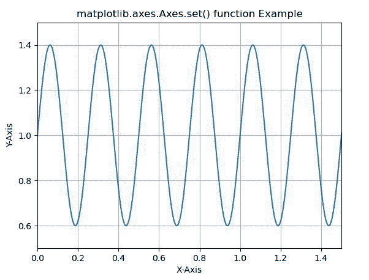
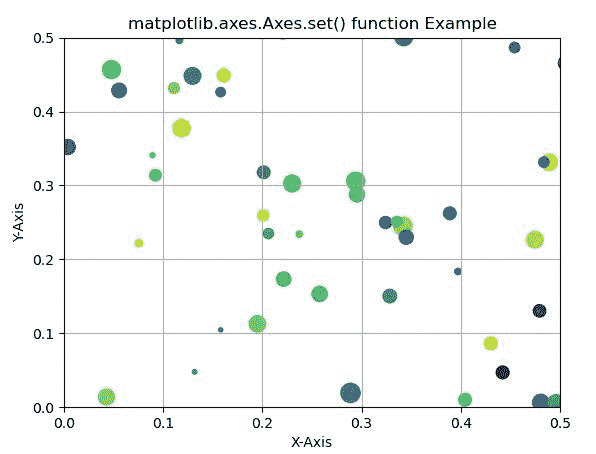

# Python 中的 Matplotlib.axes.Axes.set()

> 原文:[https://www . geeksforgeeks . org/matplotlib-axes-axes-set-in-python/](https://www.geeksforgeeks.org/matplotlib-axes-axes-set-in-python/)

**[Matplotlib](https://www.geeksforgeeks.org/python-introduction-matplotlib/)** 是 Python 中的一个库，是 NumPy 库的数值-数学扩展。**轴类**包含了大部分的图形元素:轴、刻度、线二维、文本、多边形等。，并设置坐标系。Axes 的实例通过回调属性支持回调。

## matplotlib.axes.Axes.set()函数

matplotlib 库的 Axes 模块中的 **Axes.set()函数**是一个属性批量设置器。传递 kwargs 以设置属性。

> **语法:** Axes.set(self，**kwargs)
> 
> **参数:**此方法不接受除*** *夸脱**以外的任何参数。

下面的例子说明了 matplotlib.axes.Axes.set()函数在 matplotlib.axes 中的作用:

**例 1:**

```py
# Implementation of matplotlib function
import matplotlib
import matplotlib.pyplot as plt
import numpy as np

t = np.arange(0.0, 2, 0.001)
s = 1 + np.sin(8 * np.pi * t)*0.4

fig, ax = plt.subplots()
ax.plot(t, s)

ax.set(xlabel ='X-Axis', ylabel ='Y-Axis',
       xlim =(0, 1.5), ylim =(0.5, 1.5),
       title ='matplotlib.axes.Axes.set()\
 function Example')
ax.grid()

plt.show()
```

**输出:**


**例 2:**

```py
# Implementation of matplotlib function
import numpy as np
import matplotlib.pyplot as plt
np.random.seed(19680801)

fig, ax = plt.subplots()

x, y, s, c = np.random.rand(4, 200)
s *= 200

ax.scatter(x, y, s, c)

ax.set(xlabel ='X-Axis', ylabel ='Y-Axis',
       xlim =(0, 0.5), ylim =(0, 0.5),
       title ='matplotlib.axes.Axes.set()\
 function Example')
ax.grid()

plt.show()
```

**输出:**
