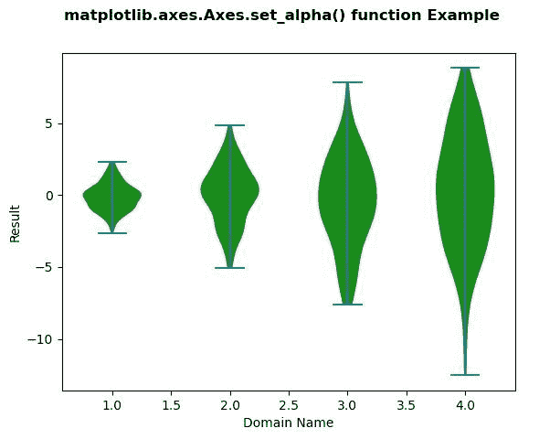
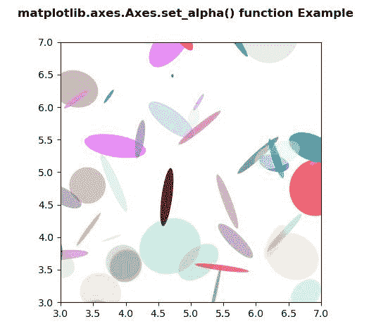

# matplotlib . axes . set _ alpha()用 Python

表示

> 哎哎哎:# t0]https://www . geeksforgeeks . org/matplot lib-axes-set _ alpha-in-python/

**[Matplotlib](https://www.geeksforgeeks.org/python-introduction-matplotlib/)** 是 Python 中的一个库，是 NumPy 库的数值-数学扩展。**轴类**包含了大部分的图形元素:轴、刻度、线二维、文本、多边形等。，并设置坐标系。Axes 的实例通过回调属性支持回调。

## matplotlib.axes.Axes.set_alpha()函数

matplotlib 库的 Axes 模块中的 **Axes.set_alpha()函数**用于设置用于混合的 alpha 值。

> **语法:** Axes.set_alpha(self，alpha)
> 
> **参数:**该方法只接受一个参数。
> 
> *   **alpha:** 此参数为包含浮点值或无。
> 
> **返回:**该方法不返回值。

下面的例子说明了 matplotlib.axes.Axes.set_alpha()函数在 matplotlib.axes 中的作用:

**例 1:**

```
# Implementation of matplotlib function
import matplotlib.pyplot as plt
import numpy as np

# create test data
np.random.seed(10**7)
data = [sorted(np.random.normal(0, std, 100)) 
       for std in range(1, 5)]

fig, ax1 = plt.subplots()
val = ax1.violinplot(data)
ax1.set_ylabel('Result')
ax1.set_xlabel('Domain Name')
for i in val['bodies']:
    i.set_facecolor('green')
    i.set_alpha(0.9) 

fig.suptitle('matplotlib.axes.Axes.set_alpha() \
function Example\n\n', fontweight ="bold")

plt.show()
```

**输出:**


**例 2:**

```
# Implementation of matplotlib function
import matplotlib.pyplot as plt
import numpy as np
from matplotlib.patches import Ellipse

NUM = 200

ells = [Ellipse(xy = np.random.rand(2) * 10,
                width = np.random.rand(), 
                height = np.random.rand(),
                angle = np.random.rand() * 360)
        for i in range(NUM)]

fig, ax = plt.subplots(subplot_kw ={'aspect': 'equal'})

for e in ells:
    ax.add_artist(e)
    e.set_clip_box(ax.bbox)
    e.set_alpha(np.random.rand())
    e.set_facecolor(np.random.rand(4))

ax.set_xlim(3, 7)
ax.set_ylim(3, 7)

fig.suptitle('matplotlib.axes.Axes.set_alpha()\
 function Example\n\n', fontweight ="bold")

plt.show()
```

**输出:**
