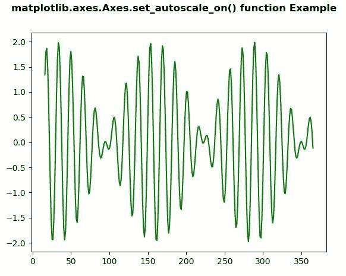
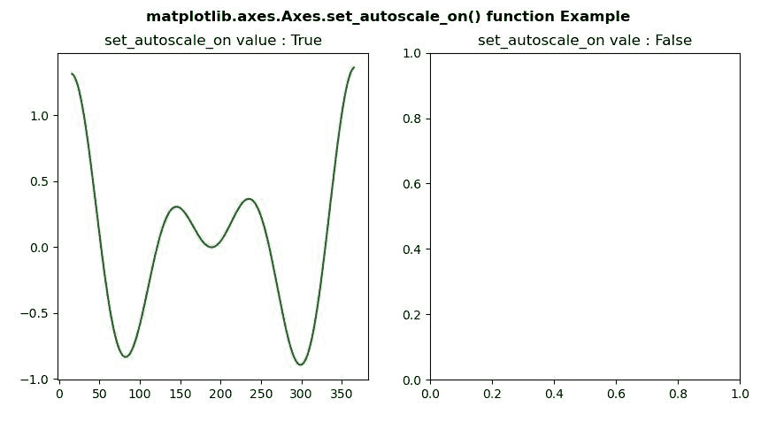

# Python 中的 matplotlib . axes . axes . set _ autoscale _ on()

> 原文:[https://www . geeksforgeeks . org/matplotlib-axes-axes-set _ autoscale _ on-in-python/](https://www.geeksforgeeks.org/matplotlib-axes-axes-set_autoscale_on-in-python/)

**[Matplotlib](https://www.geeksforgeeks.org/python-introduction-matplotlib/)** 是 Python 中的一个库，是 NumPy 库的数值-数学扩展。**轴类**包含了大部分的图形元素:轴、刻度、线二维、文本、多边形等。，并设置坐标系。Axes 的实例通过回调属性支持回调。

## matplotlib . axes . axes . set _ autoscale _ on()函数

matplotlib 库的 Axes 模块中的 **Axes.set_autoscale_on()函数**用于设置绘图命令是否应用自动缩放。

> **语法:** Axes.set_autoscale_on(self，b)
> 
> **参数:**该方法接受以下参数。
> 
> *   **b:** 此参数用于决定是否对绘图命令应用自动缩放。
> 
> **返回值:**此方法不返回值。

下面的例子说明了 matplotlib.axes . axes . set _ autoscale _ on()函数在 matplotlib . axes 中的作用:

**例 1:**

```
# ImpleIn Reviewtation of matplotlib function  
import numpy as np
import matplotlib.pyplot as plt

xdata = np.linspace(16, 365, 300)
ydata = np.sin(2 * np.pi * xdata / 15) + np.cos(2 * np.pi * xdata / 17)

fig, ax = plt.subplots()

ax.plot(xdata, ydata, 'g-')
ax.set_autoscale_on(True)

fig.suptitle('matplotlib.axes.Axes.set_autoscale_on() function\
 Example\n', fontweight ="bold")
fig.canvas.draw()
plt.show()
```

**输出:**


**例 2:**

```
# ImpleIn Reviewtation of matplotlib function  
import numpy as np
import matplotlib.pyplot as plt

xdata = np.linspace(16, 365, (365-16)*4)
ydata = np.sin(2 * np.pi * xdata / 153) + np.cos(2 * np.pi * xdata / 127)

fig, (ax, ax1) = plt.subplots(1, 2)

ax.plot(xdata, ydata, 'g-')
ax1.set_autoscale_on(True)
ax.set_title("set_autoscale_on value : True")
ax1.plot(xdata, ydata, 'g-')
ax1.set_autoscale_on(False)
ax1.set_title("set_autoscale_on vale : False")

fig.suptitle('matplotlib.axes.Axes.set_autoscale_on() function \
Example\n', fontweight ="bold")
fig.canvas.draw()
plt.show()
```

**输出:**
