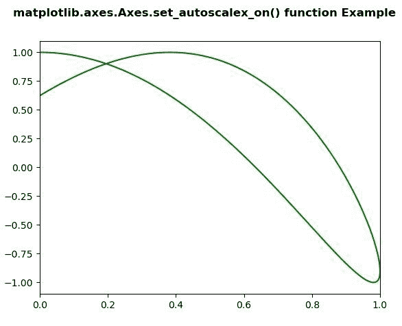
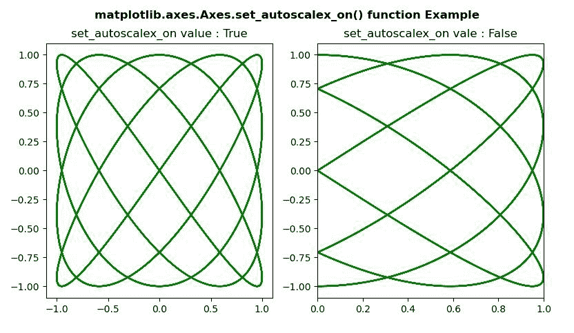

# Python 中的 matplotlib . axes . axes . set _ autoscalex _ on()

> 原文:[https://www . geeksforgeeks . org/matplotlib-axes-axes-set _ autoscalex _ on-in-python/](https://www.geeksforgeeks.org/matplotlib-axes-axes-set_autoscalex_on-in-python/)

[**Matplotlib**](https://www.geeksforgeeks.org/python-introduction-matplotlib/) 是 Python 中的一个库，是 NumPy 库的数值-数学扩展。**轴类**包含了大部分的图形元素:轴、刻度、线二维、文本、多边形等。，并设置坐标系。Axes 的实例通过回调属性支持回调。

matplotlib.axes.Axes.set_autoscalex_on() Function

matplotlib 库的 Axes 模块中的 **Axes.set_autoscalex_on()函数**用于设置 x 轴的自动缩放是否应用于绘图命令。

> **语法:** Axes.set_autoscalex_on(self，b)
> T3】参数:此方法接受以下参数。
> 
> *   **b:** 此参数用于设置 x 轴的自动缩放是否应用于绘图命令。
> 
> **返回值:**此方法不返回值。

以下示例说明 matplotlib . axes . axes . set _ autoscalex _ on()函数在 matplotlib.axes:
**示例 1:**

## 蟒蛇 3

```
# ImpleIn Reviewtation of matplotlib function 
import numpy as np
import matplotlib.pyplot as plt

t = np.linspace(0, 20, 300)
xdata = np.sin(np.pi * t / 12)
ydata = np.cos(4 * np.pi * t / 21)

fig, ax = plt.subplots()

ax.plot(xdata, ydata, 'g-')
ax.set_autoscalex_on(False)

fig.suptitle('matplotlib.axes.Axes.set_autoscalex_on() \
function Example\n', fontweight ="bold")
fig.canvas.draw()
plt.show()
```

**输出:**



**例 2:**

## 蟒蛇 3

```
# ImpleIn Reviewtation of matplotlib function 
import numpy as np
import matplotlib.pyplot as plt

t = np.linspace(16, 365, (365-16)*4)
xdata = np.sin(2 * np.pi * t / 15)
ydata = np.cos(2 * np.pi * t / 12)

fig, (ax, ax1) = plt.subplots(1, 2)

ax.plot(xdata, ydata, 'g-')
ax1.set_autoscalex_on(True)
ax.set_title("set_autoscalex_on value : True")
ax1.plot(xdata, ydata, 'g-')
ax1.set_autoscalex_on(False)
ax1.set_title("set_autoscalex_on value : False")

fig.suptitle('matplotlib.axes.Axes.set_autoscalex_on() \
function Example\n', fontweight ="bold")
fig.canvas.draw()
plt.show()
```

**输出:**

