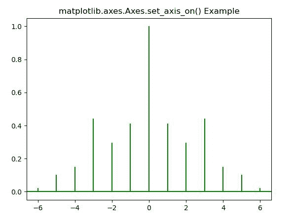
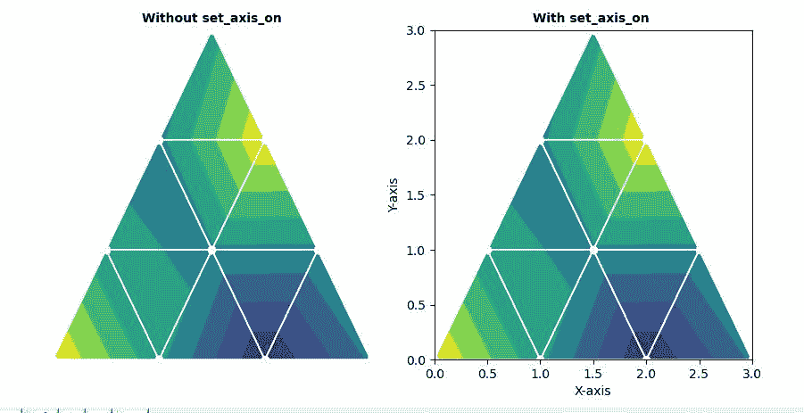

# Python 中的 matplotlib . axes . axes . set _ axis _ on()

> 原文:[https://www . geeksforgeeks . org/matplotlib-axes-axes-set _ axis _ on-in-python/](https://www.geeksforgeeks.org/matplotlib-axes-axes-set_axis_on-in-python/)

**[Matplotlib](https://www.geeksforgeeks.org/python-introduction-matplotlib/)** 是 Python 中的一个库，是 NumPy 库的数值-数学扩展。**轴类**包含了大部分的图形元素:轴、刻度、线二维、文本、多边形等。，并设置坐标系。Axes 的实例通过回调属性支持回调。

## matplotlib . axes . axes . set _ axis _ on()函数

matplotlib 库的 Axes 模块中的 **Axes.set_axis_on()函数**用于打开 x 轴和 y 轴，这会影响轴线、刻度、标签、网格和轴标签。

> **语法:** Axes.set_axis_on(self)
> 
> **参数:**此方法不接受任何参数。
> 
> **返回:**这个方法不返回任何东西。

**注意:**该功能仅在之前使用 set_axis_off 功能时有效。

下面的例子说明了 matplotlib.axes . axes . set _ axis _ on()函数在 matplotlib . axes 中的作用:

**例 1:**

```py
# Implementation of matplotlib function
import matplotlib.pyplot as plt
import numpy as np

# Time series data
geeksx = np.array([24.40, 110.25, 20.05,
                   22.00, 61.90, 7.80, 
                   15.00])

geeksy = np.array([24.40, 110.25, 20.05,
                   22.00, 61.90, 7.80,
                   15.00])

fig, ax = plt.subplots()
ax.xcorr(geeksx,  geeksy, maxlags = 6, 
         color ="green")

ax.set_axis_off()
ax.set_axis_on()
ax.set_title('matplotlib.axes.Axes.set_axis_on() \
Example')
plt.show()
```

**输出:**


**例 2:**

```py
# Implementation of matplotlib function
import matplotlib.pyplot as plt
import matplotlib.tri as mtri
import numpy as np

x = np.asarray([0, 1, 2, 3, 0.5,
                1.5, 2.5, 1, 2,
                1.5])
y = np.asarray([0, 0, 0, 0, 1.0,
                1.0, 1.0, 2, 2,
                3.0])

triangles = [[0, 1, 4], [1, 5, 4], 
             [2, 6, 5], [4, 5, 7],
             [5, 6, 8], [5, 8, 7], 
             [7, 8, 9], [1, 2, 5], 
             [2, 3, 6]]

triang = mtri.Triangulation(x, y, triangles)
z = np.cos(1.5 * x) * np.cos(1.5 * y)

fig, [axs, axs1] = plt.subplots(1, 2)
axs.tricontourf(triang, z)
axs.triplot(triang, 'go-', color ='white')
axs.set_axis_off()
axs.set_title('Without set_axis_on', 
              fontsize = 10, 
              fontweight ='bold')

axs1.tricontourf(triang, z)
axs1.triplot(triang, 'go-', color ='white')
axs1.set_xlabel("X-axis")
axs1.set_ylabel("Y-axis")
axs1.set_axis_off()

axs1.set_axis_on()
axs1.set_title('With set_axis_on ',
               fontsize = 10,
               fontweight ='bold')

plt.show()
```

**输出:**
