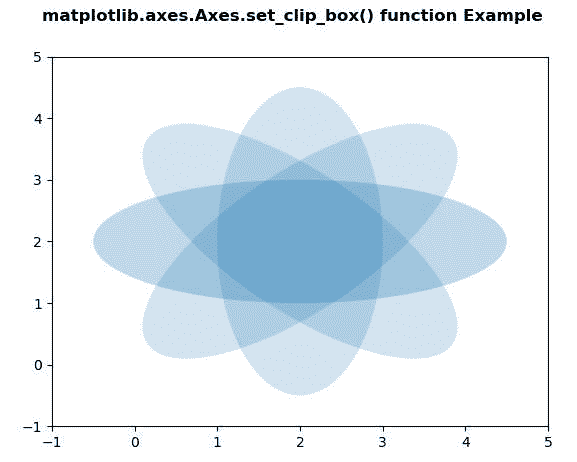
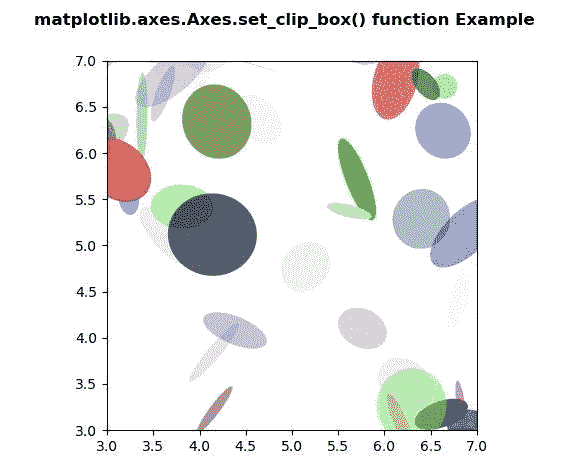

# Python 中的 matplotlib . axes . axes . set _ clip _ box()

> 原文:[https://www . geeksforgeeks . org/matplotlib-axes-axes-set _ clip _ box-in-python/](https://www.geeksforgeeks.org/matplotlib-axes-axes-set_clip_box-in-python/)

**[Matplotlib](https://www.geeksforgeeks.org/python-introduction-matplotlib/)** 是 Python 中的一个库，是 NumPy 库的数值-数学扩展。**轴类**包含了大部分的图形元素:轴、刻度、线二维、文本、多边形等。，并设置坐标系。Axes 的实例通过回调属性支持回调。

## matplotlib . axes . axes . set _ clip _ box()函数

matplotlib 库的 Axes 模块中的 **Axes.set_clip_box()函数**用于设置艺术家的剪辑 Bbox。

> **语法:** Axes.set_clip_box(self，clipbox)
> 
> **参数:**该方法只接受一个参数。
> 
> *   **剪贴簿:**这个参数是 Bbox。
> 
> **返回:**该方法不返回值。

下面的例子说明了 matplotlib.axes . axes . set _ clip _ box()函数在 matplotlib . axes 中的作用:

**例 1:**

```py
# Implementation of matplotlib function
import matplotlib.pyplot as plt
import numpy as np
from matplotlib.patches import Ellipse

delta = 45.0

angles = np.arange(0, 360 + delta, delta)
ells = [Ellipse((2, 2), 5, 2, a) for a in angles]

fig, ax = plt.subplots()

for e in ells:
    e.set_clip_box(ax.bbox)
    e.set_alpha(0.1)
    ax.add_artist(e)

plt.xlim(-1, 5)
plt.ylim(-1, 5)

fig.suptitle('matplotlib.axes.Axes.set_clip_box() \
function Example\n\n', fontweight ="bold")

plt.show()
```

**输出:**


**示例-2:**

```py
# Implementation of matplotlib function
import matplotlib.pyplot as plt
import numpy as np
from matplotlib.patches import Ellipse

NUM = 200

ells = [Ellipse(xy = np.random.rand(2) * 10,
                width = np.random.rand(), 
                height = np.random.rand(),
                angle = np.random.rand() * 360)
        for i in range(NUM)]

fig, ax = plt.subplots(subplot_kw ={'aspect': 'equal'})
for e in ells:
    ax.add_artist(e)
    e.set_clip_box(ax.bbox)
    e.set_alpha(np.random.rand())
    e.set_facecolor(np.random.rand(4))

ax.set_xlim(3, 7)
ax.set_ylim(3, 7)

fig.suptitle('matplotlib.axes.Axes.set_clip_box() \
function Example\n\n', fontweight ="bold")

plt.show()
```

**输出:**
