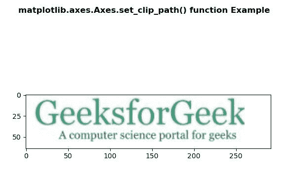
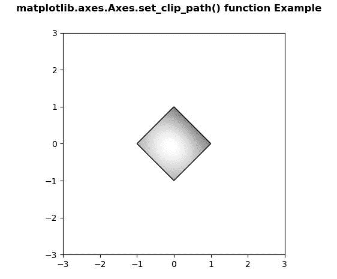

# Python 中的 matplotlib . axes . axes . set _ clip _ path()

> 原文:[https://www . geeksforgeeks . org/matplotlib-axes-axes-set _ clip _ path-in-python/](https://www.geeksforgeeks.org/matplotlib-axes-axes-set_clip_path-in-python/)

**[Matplotlib](https://www.geeksforgeeks.org/python-introduction-matplotlib/)** 是 Python 中的一个库，是 NumPy 库的数值-数学扩展。**轴类**包含了大部分的图形元素:轴、刻度、线二维、文本、多边形等。，并设置坐标系。Axes 的实例通过回调属性支持回调。

## matplotlib . axes . axes . set _ clip _ path()函数

matplotlib 库的 Axes 模块中的 **Axes.set_clip_path()函数**用于设置艺术家的剪辑路径。

> **语法:** Axes.set_clip_path(自身，路径，变换=无)
> 
> **参数:**该方法只接受两个参数。
> 
> *   **路径:**此参数为剪辑路径。
> *   **变换:**使用变换将路径转换为已变换路径的参数。
> 
> **返回:**该方法不返回值。

下面的例子说明了 matplotlib.axes . axes . set _ clip _ path()函数在 matplotlib . axes 中的作用:

**例 1:**

**输入图像:**


```
# Implementation of matplotlib function
import matplotlib.pyplot as plt
import matplotlib.patches as patches
import matplotlib.cbook as cbook

with cbook.get_sample_data('loggf.PNG') as image_file:
    image = plt.imread(image_file)

fig, ax = plt.subplots()
im = ax.imshow(image)
patch = patches.Rectangle((0, 0),
                          260,
                          200, 
                          transform = ax.transData)
im.set_clip_path(patch)

fig.suptitle('matplotlib.axes.Axes.set_clip_path() \
function Example\n\n', fontweight ="bold")

plt.show()
```

**输出:**


**例 2:**

```
# Implementation of matplotlib function
import numpy as np
import matplotlib.cm as cm
import matplotlib.pyplot as plt
from matplotlib.path import Path
from matplotlib.patches import PathPatch

delta = 0.025

x = y = np.arange(-3.0, 3.0, delta)
X, Y = np.meshgrid(x, y)

Z1 = np.exp(-X**2 - Y**2)
Z2 = np.exp(-(X - 1)**2 - (Y - 1)**2)
Z = (Z1 - Z2) * 2

path = Path([[0, 1], [1, 0], [0, -1],
            [-1, 0], [0, 1]])
patch = PathPatch(path, facecolor ='none')

fig, ax = plt.subplots()
ax.add_patch(patch)

im = ax.imshow(Z,
               interpolation ='bilinear', 
               cmap = cm.gray,
               origin ='lower', 
               extent =[-3, 3, -3, 3],
               clip_path = patch, 
               clip_on = True)

im.set_clip_path(patch)

fig.suptitle('matplotlib.axes.Axes.set_clip_path() \
function Example\n\n', fontweight ="bold")

plt.show()
```

**输出:**
