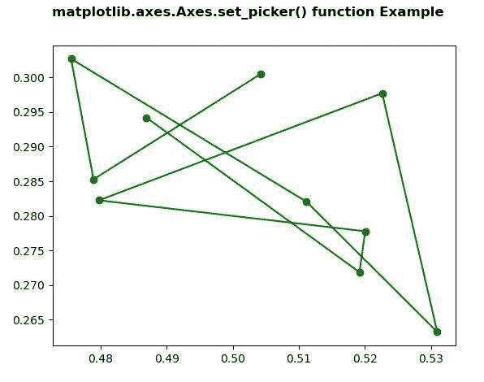
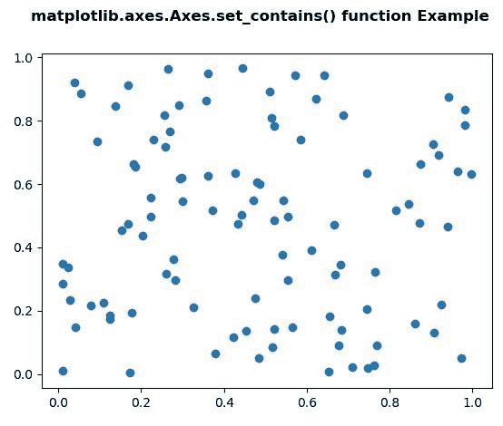

# Python 中的 matplotlib . axes . axes . set _ contains()

> 原文:[https://www . geeksforgeeks . org/matplotlib-axes-axes-set _ contains-in-python/](https://www.geeksforgeeks.org/matplotlib-axes-axes-set_contains-in-python/)

**[Matplotlib](https://www.geeksforgeeks.org/python-introduction-matplotlib/)** 是 Python 中的一个库，是 NumPy 库的数值-数学扩展。**轴类**包含了大部分的图形元素:轴、刻度、线二维、文本、多边形等。，并设置坐标系。Axes 的实例通过回调属性支持回调。

## matplotlib . axes . axes . set _ contains()函数

matplotlib 库的 Axes 模块中的 **Axes.set_contains()函数**用于为艺术家定义自定义的包含测试。

> **语法:** Axes.set_contains(self，picker)
> 
> **参数:**该方法接受以下参数，如下所述:
> 
> *   **选取器:**此参数是自定义选取器功能，用于评估事件是否在艺术家内。
> 
> **返回:**该方法不返回值。

下面的例子说明了 matplotlib.axes . axes . set _ contains()函数在 matplotlib . axes 中的作用:

**例 1:**

```
# Implementation of matplotlib function
import matplotlib.pyplot as plt
from matplotlib.lines import Line2D
from matplotlib.patches import Rectangle
from matplotlib.text import Text
from matplotlib.image import AxesImage
import numpy as np
from numpy.random import rand

fig, (ax1, ax2) = plt.subplots(2, 1)
ax1.set_ylabel('ylabel', picker = True,
               bbox = dict(facecolor ='red'))

line, = ax1.plot(rand(100), 'go-')

ax2.bar(range(10), rand(10), picker = True)

for label in ax2.get_xticklabels(): 
    label.set_picker(True)

def onpick1(event):

    if isinstance(event.artist, Line2D):
        thisline = event.artist
        xdata = thisline.get_xdata()
        ydata = thisline.get_ydata()
        ind = event.ind
        print('onpick1 line:', np.column_stack([xdata[ind],
                                                ydata[ind]]))

    elif isinstance(event.artist, Rectangle):
        patch = event.artist
        print('onpick1 patch:', patch.get_path())

    elif isinstance(event.artist, Text):
        text = event.artist
        print('onpick1 text:', text.get_text())

ax2.set_contains(onpick1)
fig.suptitle('matplotlib.axes.Axes.set_contains() function\
Example', fontweight ="bold")

plt.show()
```

**输出:**


**例 2:**

```
# Implementation of matplotlib function
import matplotlib.pyplot as plt
from matplotlib.lines import Line2D
from matplotlib.patches import Rectangle
from matplotlib.text import Text
from matplotlib.image import AxesImage
import numpy as np
from numpy.random import rand

def line_picker(line, mouseevent):

    if mouseevent.xdata is None:
        return False, dict()

    xdata = line.get_xdata()
    ydata = line.get_ydata()
    maxd = 0.05
    d = np.sqrt(
        (xdata - mouseevent.xdata)**2 + (ydata - mouseevent.ydata)**2)

    ind, = np.nonzero(d <= maxd)

    if len(ind):

        pickx = xdata[ind]
        picky = ydata[ind]
        props = dict(ind = ind, pickx = pickx, picky = picky)
        return True, props

    else:
        return False, dict()

def onpick2(event):

    print('Result :', event.pickx, event.picky)

fig, ax = plt.subplots()
ax.plot(rand(100), rand(100), 'o')

ax.set_contains(picker = line_picker)

fig.canvas.mpl_connect('pick_event', onpick2)

fig.suptitle('matplotlib.axes.Axes.set_contains()\
function Example', fontweight ="bold")

plt.show()
```

**输出:**
