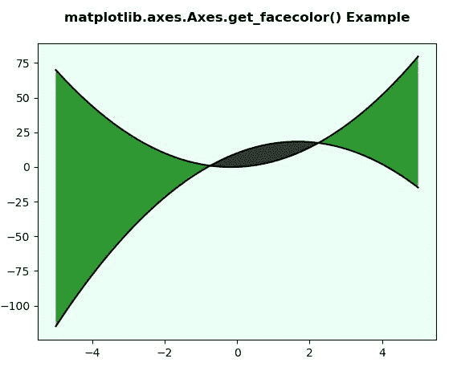
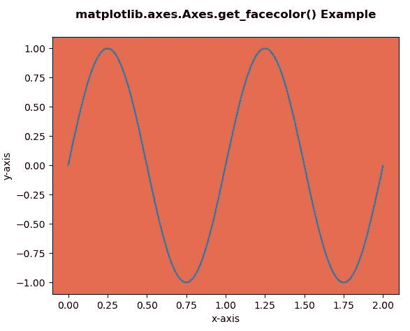

# matplotlib . axes . set _ face color()用 Python

表示

> 哎哎哎:# t0]https://www . geeksforgeeks . org/matplotlib-axes-set _ face color-in-python/

**[Matplotlib](https://www.geeksforgeeks.org/python-introduction-matplotlib/)** 是 Python 中的一个库，是 NumPy 库的数值-数学扩展。**轴类**包含了大部分的图形元素:轴、刻度、线二维、文本、多边形等。，并设置坐标系。Axes 的实例通过回调属性支持回调。

## matplotlib . axes . axes . set _ face color()函数

matplotlib 库的 axes 模块中的 **Axes.set_facecolor()函数**用于设置 Axes 的 facecolor..

> **语法:** Axes.set_facecolor(self，color)
> 
> **参数:**该方法只接受一个参数。
> **颜色:**此参数接受轴的面颜色。
> 
> **返回:**此方法不返回任何值。

下面的例子说明了 matplotlib.axes . axes . set _ face color()函数在 matplotlib . axes 中的作用:

**例 1:**

```
# Implementation of matplotlib function
import numpy as np
import matplotlib.pyplot as plt

x = np.arange(-5, 5, 0.01)
y1 = -3 * x*x + 10 * x + 10
y2 = 3 * x*x + x

fig, ax = plt.subplots()
ax.plot(x, y1, x, y2, color ='black')
ax.fill_between(x, y1, y2, where = y2 >y1,
                facecolor ='green', alpha = 0.8)
ax.fill_between(x, y1, y2, where = y2 <= y1,
               facecolor ='black', alpha = 0.8)

ax.set_facecolor('# eafff5')
ax.set_title('matplotlib.axes.Axes.get_facecolor() \
Example\n', fontsize = 12, fontweight ='bold')
plt.show()
```

**输出:**


**例 2:**

```
# Implementation of matplotlib function
import numpy as np
import matplotlib.pyplot as plt

t = np.linspace(0.0, 2.0, 201)
s = np.sin(2 * np.pi * t)

fig, ax = plt.subplots()
ax.set_facecolor('# E56B51')
ax.set_xlabel('x-axis')
ax.set_ylabel('y-axis')
ax.plot(t, s, )
ax.set_title('matplotlib.axes.Axes.get_facecolor()\
 Example\n', fontsize = 12, fontweight ='bold')
plt.show()
```

**输出:**
