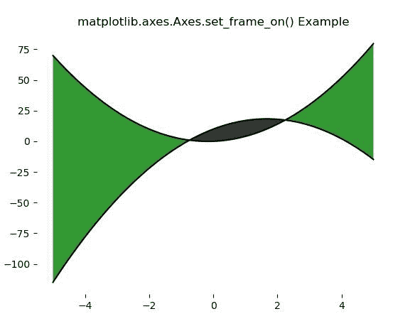
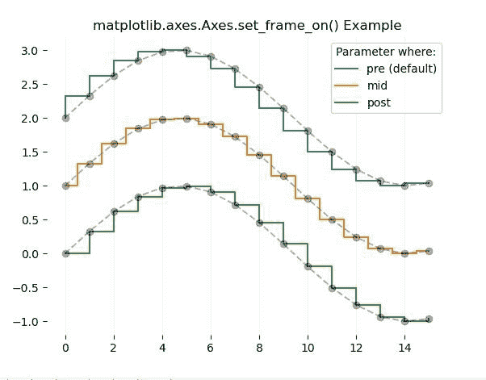

# Python 中的 matplotlib . axes . axes . set _ frame _ on()

> 原文:[https://www . geeksforgeeks . org/matplotlib-axes-axes-set _ frame _ on-in-python/](https://www.geeksforgeeks.org/matplotlib-axes-axes-set_frame_on-in-python/)

**[Matplotlib](https://www.geeksforgeeks.org/python-introduction-matplotlib/)** 是 Python 中的一个库，是 NumPy 库的数值-数学扩展。**轴类**包含了大部分的图形元素:轴、刻度、线二维、文本、多边形等。，并设置坐标系。Axes 的实例通过回调属性支持回调。

## matplotlib . axes . axes . set _ frame _ on()函数

matplotlib 库的 Axes 模块中的 **Axes.set_frame_on()函数**用于设置是否绘制轴矩形面片。

> **语法:** Axes.set_axis_on(self)
> 
> **参数:**该方法只接受一个参数。
> 
> *   **b:** This parameter contains a boolean value and it is used for drawing the axes rectangle patch.
>     
>     **返回:**这个方法不返回任何东西。

**注意:**如果用 True，对任何事情都没有影响。
下面的例子说明了 matplotlib.axes . set _ frame _ on()函数在 matplotlib . axes 中的作用:

**例 1:**

```py
# Implementation of matplotlib function
import numpy as np
import matplotlib.pyplot as plt

x = np.arange(-5, 5, 0.01)
y1 = -3 * x*x + 10 * x + 10
y2 = 3 * x*x + x

fig, ax = plt.subplots()
ax.plot(x, y1, x, y2, color ='black')
ax.fill_between(x, y1, y2, where = y2 >y1,
               facecolor ='green', alpha = 0.8)
ax.fill_between(x, y1, y2, where = y2 <= y1,
               facecolor ='black', alpha = 0.8)

ax.set_frame_on(False)
ax.set_title('matplotlib.axes.Axes.set_frame_on() Example')
plt.show()
```

**输出:**


**例 2:**

```py
# Implementation of matplotlib function
import numpy as np
import matplotlib.pyplot as plt

x = np.arange(16)
y = np.sin(x / 3)

fig, ax = plt.subplots()

ax.step(x, y + 2, label ='pre (default)')
ax.plot(x, y + 2, 'o--', color ='black', alpha = 0.3)

ax.step(x, y + 1, where ='mid', label ='mid')
ax.plot(x, y + 1, 'o--', color ='black', alpha = 0.3)

ax.step(x, y, where ='post', label ='post')
ax.plot(x, y, 'o--', color ='black', alpha = 0.3)

ax.grid(axis ='x', color ='0.95')
ax.legend(title ='Parameter where:')
ax.set_frame_on(False)
ax.set_title('matplotlib.axes.Axes.set_frame_on() Example')
plt.show()
```

**输出:**
