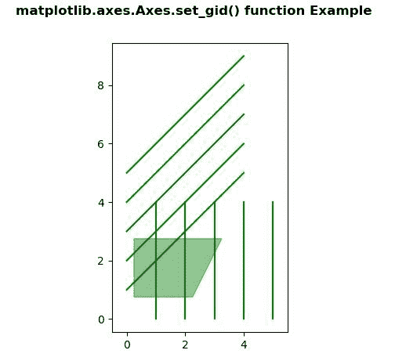
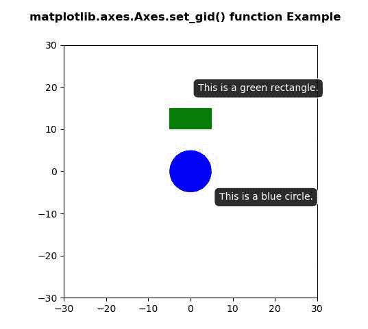

# matplotlib . axes . set _ GID()用 Python

表示

> 原文:[https://www . geeksforgeeks . org/matplotlib-axes-axes-set _ GID-in-python/](https://www.geeksforgeeks.org/matplotlib-axes-axes-set_gid-in-python/)

**[Matplotlib](https://www.geeksforgeeks.org/python-introduction-matplotlib/)** 是 Python 中的一个库，是 NumPy 库的数值-数学扩展。**轴类**包含了大部分的图形元素:轴、刻度、线二维、文本、多边形等。，并设置坐标系。Axes 的实例通过回调属性支持回调。

## matplotlib.axes.Axes.set_gid()函数

matplotlib 库的 Axes 模块中的 **Axes.set_gid()函数**用于设置艺术家的(组)id。

> **语法:** Axes.set_gid(self，gid)
> 
> **参数:**该方法只接受一个参数。
> 
> *   **gid:** 这个参数是 gid 给出的字符串。
> 
> **返回:**该方法不返回值。

下面的例子说明了 matplotlib.axes.Axes.set_gid()函数在 matplotlib.axes 中的作用:

**例 1:**

```py
# Implementation of matplotlib function
import numpy as np
import matplotlib.pyplot as plt

y, x = np.mgrid[:5, 1:6]
poly_coords = [
    (0.25, 2.75), (3.25, 2.75),
    (2.25, 0.75), (0.25, 0.75)
]

fig, ax = plt.subplots()

cells = ax.plot(x, y, x + y, color ='green')
ax.add_patch(
    plt.Polygon(poly_coords, 
                color ='forestgreen', 
                alpha = 0.5)
    )
ax.margins(x = 0.1, y = 0.05)
ax.set_aspect('equal')

for i, t in enumerate(ax.patches):
    t.set_gid('patch_% d' % i)

fig.suptitle('matplotlib.axes.Axes.set_gid() \
function Example\n\n', fontweight ="bold")

plt.show()
```

**输出:**


**例 2:**

```py
# Implementation of matplotlib function
import numpy as np
import matplotlib.pyplot as plt

fig, ax = plt.subplots()

circle = plt.Circle((0, 0), 5, fc ='blue')
rect = plt.Rectangle((-5, 10), 10, 5, fc ='green')

ax.add_patch(circle)
ax.add_patch(rect)

circle_tip = ax.annotate('This is a blue circle.',
            xy =(0, 0),
            xytext =(30, -30),
            textcoords ='offset points',
            color ='w',
            ha ='left',
            bbox = dict(boxstyle ='round, pad =.5', 
                        fc =(.1, .1, .1, .92),
                        ec =(1., 1., 1.), 
                        lw = 1,
                        zorder = 1),
            )

rect_tip = ax.annotate('This is a green rectangle.',
            xy =(-5, 10),
            xytext =(30, 40),
            textcoords ='offset points',
            color ='w',
            ha ='left',
            bbox = dict(boxstyle ='round, pad =.5',
                        fc =(.1, .1, .1, .92), 
                        ec =(1., 1., 1.), 
                        lw = 1,
                        zorder = 1),
            )

for i, t in enumerate(ax.patches):
    t.set_gid('patch_% d'% i)

for i, t in enumerate(ax.texts):
    t.set_gid('tooltip_% d'% i)

ax.set_xlim(-30, 30)
ax.set_ylim(-30, 30)
ax.set_aspect('equal')

fig.suptitle('matplotlib.axes.Axes.set_gid() function \
Example\n\n', fontweight ="bold")

plt.show()
```

**输出:**
