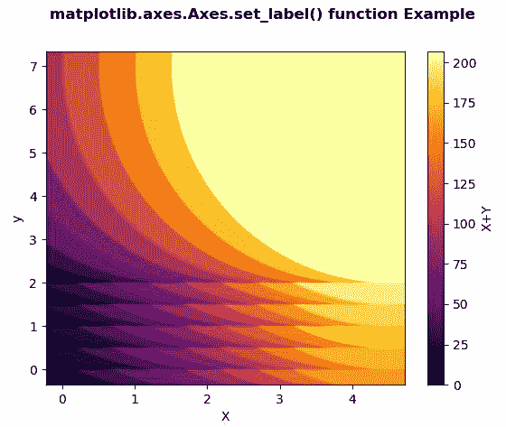
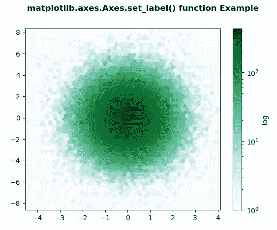

# matplotlib . axes . set _ label()用 Python

表示

> 哎哎哎:# t0]https://www . geeksforgeeks . org/matplot lib-axes-set _ label-in-python/

**[Matplotlib](https://www.geeksforgeeks.org/python-introduction-matplotlib/)** 是 Python 中的一个库，是 NumPy 库的数值-数学扩展。**轴类**包含了大部分的图形元素:轴、刻度、线二维、文本、多边形等。，并设置坐标系。Axes 的实例通过回调属性支持回调。

## matplotlib.axes.Axes.set_label()函数

matplotlib 库的 Axes 模块中的 **Axes.set_label()函数**用于设置将在图例中显示的标签。

> **语法:** Axes.set_label(self，s)
> 
> **参数:**该方法只接受一个参数。
> 
> *   **s:** 此参数通过调用 str 转换为字符串。
> 
> **返回:**该方法不返回值。

下面的例子说明了 matplotlib.axes.Axes.set_label()函数在 matplotlib.axes 中的作用:

**例 1:**

```
# Implementation of matplotlib function  
import matplotlib.pyplot as plt
import numpy as np
from matplotlib.collections import EllipseCollection

x = np.arange(10)
y = np.arange(15)
X, Y = np.meshgrid(x, y)

XY = np.column_stack((X.ravel(), Y.ravel()))

fig, ax = plt.subplots()

ec = EllipseCollection(10, 10, 5, units ='y',
                       offsets = XY * 0.5,
                       transOffset = ax.transData,
                       cmap ="inferno")

ec.set_array((X * Y + X * X).ravel())

ax.add_collection(ec)
ax.autoscale_view()

ax.set_xlabel('X')
ax.set_ylabel('y')

cbar = plt.colorbar(ec)
cbar.set_label('X + Y')

fig.suptitle('matplotlib.axes.Axes.set_label() function \
Example\n', fontweight ="bold")

fig.canvas.draw()

plt.show()
```

**输出:**


**例 2:**

```
# Implementation of matplotlib function
import matplotlib.pyplot as plt
import numpy as np

np.random.seed(19680801)

n = 100000
x = np.random.standard_normal(n)
y = 2 * np.random.standard_normal(n)
z =[1, 2, 3, 4]

xmin = x.min()
xmax = x.max()
ymin = y.min()
ymax = y.max()

fig, ax = plt.subplots()
hb = ax.hexbin(x, y, gridsize = 50, bins ='log', cmap ='BuGn')
ax.set(xlim =(xmin, xmax), ylim =(ymin, ymax))

cb = fig.colorbar(hb, ax = ax)
cb.set_label('log')

fig.suptitle('matplotlib.axes.Axes.set_label() function\
 Example\n', fontweight ="bold")

fig.canvas.draw()

plt.show()
```

**输出:**
