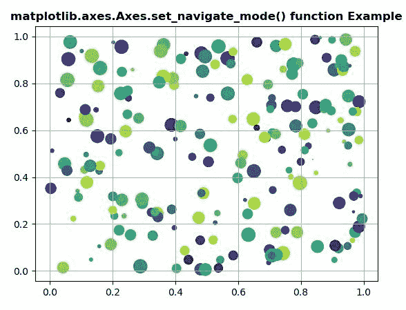
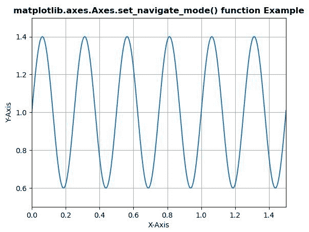

# Python 中的 matplotlib . axes . axes . set _ navigate _ mode()

> 原文:[https://www . geeksforgeeks . org/matplotlib-axes-axes-set _ navive _ mode-in-python/](https://www.geeksforgeeks.org/matplotlib-axes-axes-set_navigate_mode-in-python/)

**[Matplotlib](https://www.geeksforgeeks.org/python-introduction-matplotlib/)** 是 Python 中的一个库，是 NumPy 库的数值-数学扩展。**轴类**包含了大部分的图形元素:轴、刻度、线二维、文本、多边形等。，并设置坐标系。Axes 的实例通过回调属性支持回调。

## matplotlib . axes . axes . set _ navigate _ mode()函数

matplotlib 库的 Axes 模块中的 **Axes.set_navigate_mode()函数**用于设置导航工具栏按钮状态。

> **语法:**axes . set _ navive _ mode(self，b)
> 
> **参数:**该方法接受以下参数。
> 
> *   **b :** 该参数为导航模式值。
> 
> **返回值:**此方法不返回值。

以下示例说明 matplotlib . axes . axes . set _ navigate _ mode()函数在 matplotlib.axes:
**示例 1:**

```
# Implementation of matplotlib function
import numpy as np
import matplotlib.pyplot as plt
np.random.seed(19680801)

fig, ax = plt.subplots()

x, y, s, c = np.random.rand(4, 200)
s *= 200

ax.scatter(x, y, s, c)
ax.set_navigate_mode("ZOOM")

ax.set_title('matplotlib.axes.Axes.set_navigate_mode()\
 function Example', fontweight ="bold")

ax.grid()

plt.show()
```

**输出:**


**例 2:**

```
# Implementation of matplotlib function
import matplotlib
import matplotlib.pyplot as plt
import numpy as np

t = np.arange(0.0, 2, 0.001)
s = 1 + np.sin(8 * np.pi * t)*0.4

fig, ax = plt.subplots()
ax.plot(t, s)

ax.set_navigate_mode("PAN")

ax.set(xlabel ='X-Axis', ylabel ='Y-Axis', 
       xlim =(0, 1.5), ylim =(0.5, 1.5))

ax.set_title('matplotlib.axes.Axes.set_navigate_mode()\
 function Example', fontweight ="bold")

ax.grid()
plt.show()
```

**输出:**
