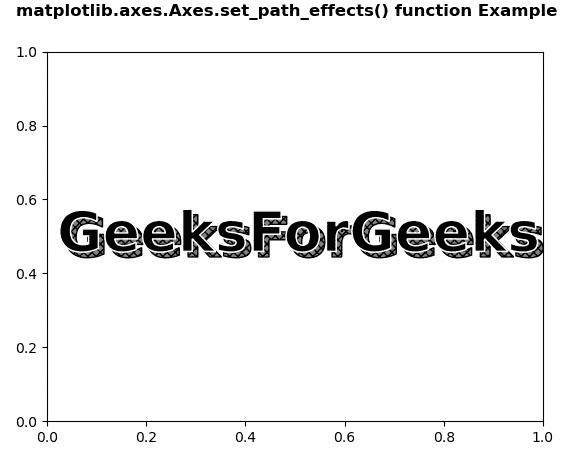
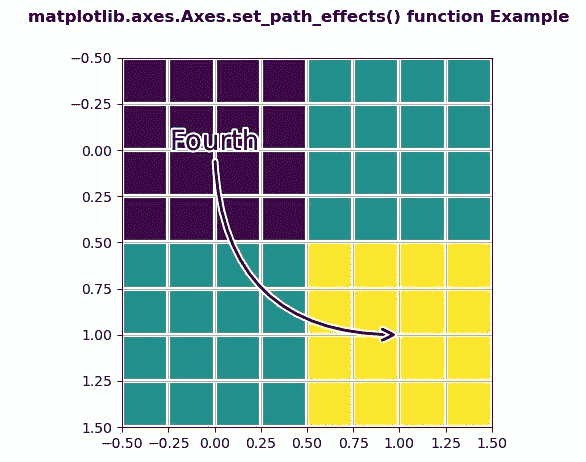

# Python 中的 matplotlib . axes . axes . set _ path _ effects()

> 原文:[https://www . geeksforgeeks . org/matplotlib-axes-axes-set _ path _ effects-in-python/](https://www.geeksforgeeks.org/matplotlib-axes-axes-set_path_effects-in-python/)

**[Matplotlib](https://www.geeksforgeeks.org/python-introduction-matplotlib/)** 是 Python 中的一个库，是 NumPy 库的数值-数学扩展。**轴类**包含了大部分的图形元素:轴、刻度、线二维、文本、多边形等。，并设置坐标系。Axes 的实例通过回调属性支持回调。

## matplotlib . axes . axes . set _ path _ effects()函数

matplotlib 库的 Axes 模块中的 **Axes.set_path_effects()函数**用于设置路径效果。

> **语法:** Axes.set_path_effects(自身，path_effects)
> 
> **参数:**该方法只接受一个参数。
> 
> *   **path_effects :** 此参数为抽象路径效果。
> 
> **返回:**该方法不返回值。

下面的例子说明了 matplotlib.axes . axes . set _ path _ effects()函数在 matplotlib . axes 中的作用:

**例 1:**

```py
# Implementation of matplotlib function
import matplotlib.pyplot as plt
import numpy as np
import matplotlib.patheffects as path_effects

fig, ax = plt.subplots()
t = ax.text(0.02, 0.5,
            'GeeksForGeeks',
            fontsize = 40, 
            weight = 1000, 
            va ='center')

t.set_path_effects([path_effects.PathPatchEffect(offset =(4, -4),
                                                 hatch ='xxxx',
                                                 facecolor ='gray'),
                    path_effects.PathPatchEffect(edgecolor ='white', 
                                                 linewidth = 1.1,
                                                 facecolor ='black')])

fig.suptitle('matplotlib.axes.Axes.set_path_effects() function\
Example\n', fontweight ="bold")

plt.show()
```

**输出:**


**例 2:**

```py
# Implementation of matplotlib function
import matplotlib.pyplot as plt
import matplotlib.patheffects as PathEffects
import numpy as np

fig, ax1 = plt.subplots()
ax1.imshow([[1, 2], [2, 3]])

txt = ax1.annotate("Fourth",
                   (1., 1.),
                   (0., 0),
                   arrowprops = dict(arrowstyle ="->",
                                     connectionstyle ="angle3",
                                     lw = 2),
                   size = 20, ha ="center",
                   path_effects =[PathEffects.withStroke(linewidth = 3,
                                                         foreground ="w")])

txt.arrow_patch.set_path_effects([
    PathEffects.Stroke(linewidth = 5, 
                       foreground ="w"),
    PathEffects.Normal()])

ax1.grid(True, linestyle ="-")

pe = [PathEffects.withStroke(linewidth = 3,
                             foreground ="w")]

for l in ax1.get_xgridlines() + ax1.get_ygridlines():
    l.set_path_effects(pe)

fig.suptitle('matplotlib.axes.Axes.set_path_effects() \
function Example\n', fontweight ="bold")

plt.show()
```

**输出:**
