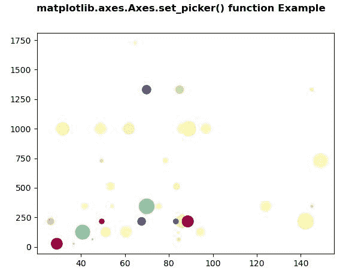

# Python 中的 matplotlib . axes . axes . set _ picker()

> 原文:[https://www . geeksforgeeks . org/matplotlib-axes-axes-set _ picker-in-python/](https://www.geeksforgeeks.org/matplotlib-axes-axes-set_picker-in-python/)

**[Matplotlib](https://www.geeksforgeeks.org/python-introduction-matplotlib/)** 是 Python 中的一个库，是 NumPy 库的数值-数学扩展。**轴类**包含了大部分的图形元素:轴、刻度、线二维、文本、多边形等。，并设置坐标系。Axes 的实例通过回调属性支持回调。

## matplotlib . axes . axes . set _ picker()函数

matplotlib 库的 Axes 模块中的 **Axes.set_picker()函数**用于定义艺术家的拾取行为。

> **语法:** Axes.set_picker(self，picker)
> 
> **参数:**该方法接受以下参数，如下所述:
> 
> *   **拣货员:**此参数用于设置拣货行为。这可以是无、布尔、浮点或函数。
> 
> **返回:**此方法返回艺术家的采摘行为。

下面的例子说明了 matplotlib.axes . axes . set _ picker()函数在 matplotlib . axes 中的作用:

**例 1:**

```
# Implementation of matplotlib function
import numpy as np
np.random.seed(19680801)
import matplotlib.pyplot as plt

volume = np.random.rayleigh(27, size = 40)
amount = np.random.poisson(7, size = 40)
ranking = np.random.normal(size = 40)
price = np.random.uniform(1, 7, size = 40)

fig, ax = plt.subplots()

scatter = ax.scatter(volume * 2, 
                     amount**3,
                     c = ranking**3,
                     s = price**3,
                     vmin = -3,
                     vmax = 3,
                     cmap ="Spectral")

ax.set_picker(4)

fig.suptitle('matplotlib.axes.Axes.set_picker() \
function Example', fontweight ="bold")

plt.show()
```

**输出:**


**例 2:**

```
# Implementation of matplotlib function
import numpy as np
import matplotlib.pyplot as plt

X = np.random.rand(10, 200)
xs = np.mean(X, axis = 1)
ys = np.std(X, axis = 1)

fig = plt.figure()
ax = fig.add_subplot(111)
line, = ax.plot(xs, ys, 'go-')

ax.set_picker(True)

fig.suptitle('matplotlib.axes.Axes.set_picker()\
 function Example', fontweight ="bold")
plt.show()
```

**输出:**
