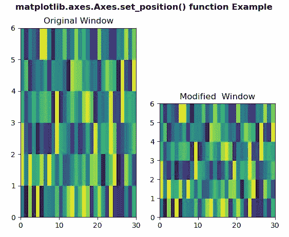

# Python 中的 matplotlib . axes . axes . set _ position()

> 原文:[https://www . geeksforgeeks . org/matplotlib-axes-axes-set _ position-in-python/](https://www.geeksforgeeks.org/matplotlib-axes-axes-set_position-in-python/)

**[Matplotlib](https://www.geeksforgeeks.org/python-introduction-matplotlib/)** 是 Python 中的一个库，是 NumPy 库的数值-数学扩展。**轴类**包含了大部分的图形元素:轴、刻度、线二维、文本、多边形等。，并设置坐标系。Axes 的实例通过回调属性支持回调。

## matplotlib . axes . axes . set _ position()函数

matplotlib 库的 Axes 模块中的 **Axes.set_position()函数**用于设置轴的位置。

> **语法:** Axes.set_position(自身)
> 
> **参数:**该方法接受以下参数。
> 
> *   **位置:**该参数是图中坐标的新位置。
> *   **哪个:**该参数用于确定要改变哪些位置变量。
> 
> **返回值:**此方法不返回值。

下面的例子说明了 matplotlib.axes . axes . set _ position()函数在 matplotlib . axes 中的作用:

**例 1:**

```py
# Implementation of matplotlib function
import matplotlib.pyplot as plt
import numpy as np

x = np.arange(10)
y = [2, 4, 6, 14, 15, 16, 17,
     16, 18, 20]
y2 = [10, 11, 12, 13, 8, 10, 
      12, 14, 18, 19]

fig, ax = plt.subplots()

ax.plot(x, y, "go-", label ='Line 1', )
ax.plot(x, y2, "o-", label ='Line 2')

chartBox = ax.get_position()
ax.set_position([chartBox.x0, chartBox.y0,
                 chartBox.width,
                 chartBox.height * 0.6])

ax.legend(loc ='upper center',
          bbox_to_anchor =(0.5, 1.45),
          shadow = True, ncol = 1)

fig.suptitle('matplotlib.axes.Axes.set_position()\
function Example', fontweight ="bold")
plt.show()
```

**输出:**


**例 2:**

```py
# Implementation of matplotlib function
import matplotlib.pyplot as plt
import numpy as np
from matplotlib.colors import LogNorm

Z = np.random.rand(6, 30)

fig, (ax, ax1) = plt.subplots(1, 2)

ax.pcolor(Z)
ax1.pcolor(Z)

chartBox = ax1.get_position()
ax1.set_position([chartBox.x0, 
                  chartBox.y0,
                  chartBox.width,
                  chartBox.height * 0.6])

ax.set_title("Original Window")
ax1.set_title("Modified  Window")

fig.suptitle('matplotlib.axes.Axes.set_position()\
function Example', fontweight ="bold")
plt.show()
```

**输出:**
