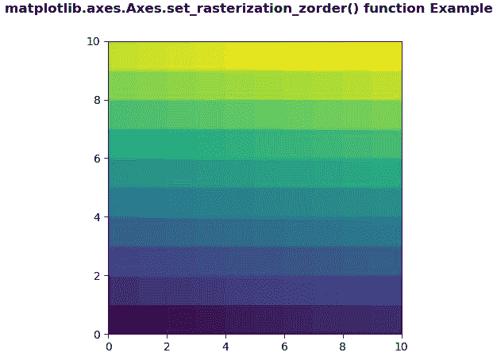
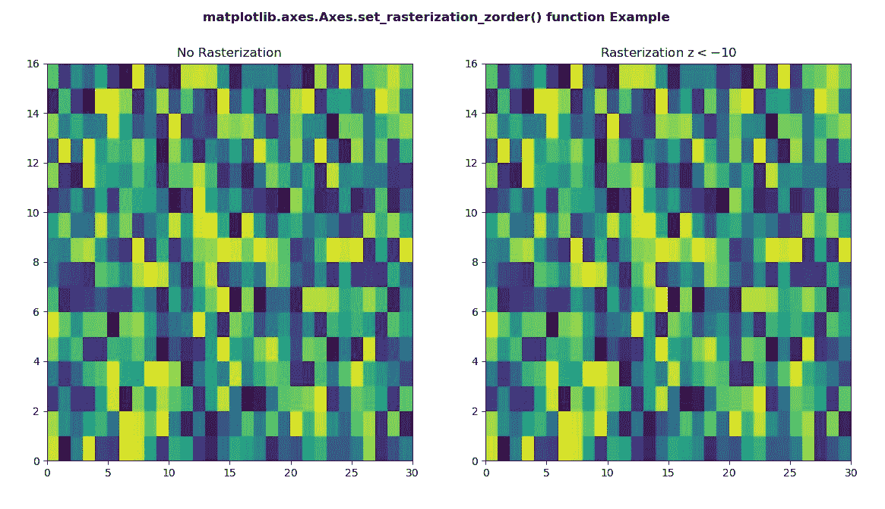

# Python 中的 matplotlib . axes . axes . set _ 栅格化 _zorder()

> 原文:[https://www . geeksforgeeks . org/matplotlib-axes-axes-set _ rasterization _ zorder-in-python/](https://www.geeksforgeeks.org/matplotlib-axes-axes-set_rasterization_zorder-in-python/)

**[Matplotlib](https://www.geeksforgeeks.org/python-introduction-matplotlib/)** 是 Python 中的一个库，是 NumPy 库的数值-数学扩展。**轴类**包含了大部分的图形元素:轴、刻度、线二维、文本、多边形等。，并设置坐标系。Axes 的实例通过回调属性支持回调。

## matplotlib . axes . axes . set _ 栅格化 _zorder()函数

matplotlib 库的 Axes 模块中的**axes . set _ 栅格化 _zorder()函数**用于返回格式化为 y 值的 y。

> **语法:**axes . set _ 栅格化 _zorder(self，z)
> 
> **参数:**
> **z :** 该参数是艺术家被光栅化的 zorder。
> 
> **返回值:**此方法不返回值。

下面的例子说明了 matplotlib.axes . axes . set _ rasterization _ zorder()函数在 matplotlib . axes 中的作用:

**例 1:**

```
# Implementation of matplotlib function
import numpy as np
import matplotlib.pyplot as plt

d = np.arange(100).reshape(10, 10)
xx, yy = np.meshgrid(np.arange(11), np.arange(11))

fig, ax = plt.subplots()

ax.set_aspect(1)
m = ax.pcolormesh(xx, yy, d)
m.set_zorder(-15)
ax.set_rasterization_zorder(-5)

fig.suptitle('matplotlib.axes.Axes.set_rasterization_zorder()\
 function Example', fontweight ="bold")
plt.show()
```

**输出:**


**例 2:**

```
# Implementation of matplotlib function
import numpy as np
import matplotlib.pyplot as plt

xx = np.random.rand(16, 30)

fig, (ax3, ax4) = plt.subplots(1, 2)

m = ax3.pcolor(xx)
m.set_zorder(-20)

ax3.set_title("No Rasterization")

m = ax4.pcolor(xx)
m.set_zorder(-20)

ax4.set_rasterization_zorder(-10)

ax4.set_title("Rasterization z{content}lt;-10{content}quot;)

fig.suptitle('matplotlib.axes.Axes.set_rasterization_zorder()\
 function Example', fontweight ="bold")
plt.show()
```

**输出:**
