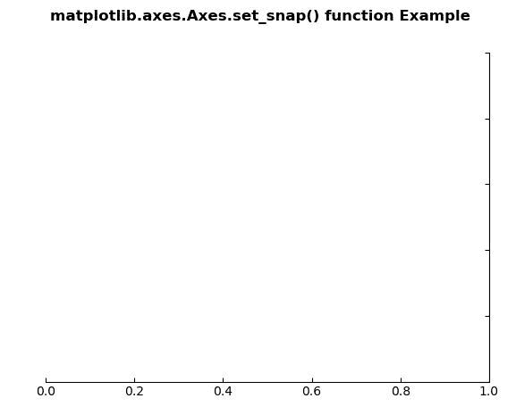
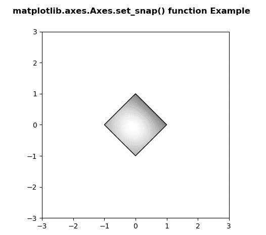

# Python 中的 Matplotlib.axes.Axes.set_snap()

> 原文:[https://www . geesforgeks . org/matplotlib-axes-axes-set _ snap-in-python/](https://www.geeksforgeeks.org/matplotlib-axes-axes-set_snap-in-python/)

**[Matplotlib](https://www.geeksforgeeks.org/python-introduction-matplotlib/)** 是 Python 中的一个库，是 NumPy 库的数值-数学扩展。**轴类**包含了大部分的图形元素:轴、刻度、线二维、文本、多边形等。，并设置坐标系。Axes 的实例通过回调属性支持回调。

## matplotlib.axes.Axes.set_snap()函数

matplotlib 库的 Axes 模块中的 **Axes.set_snap()函数**用于设置捕捉行为。

> **语法:** Axes.set_snap(自，snap)
> 
> **参数:**该方法只接受一个参数。
> 
> *   **捕捉:**此参数包含布尔值或无。
> 
> **返回:**该方法不返回值。

下面的例子说明了 matplotlib.axes.Axes.set_snap()函数在 matplotlib.axes 中的作用:

**例 1:**

```py
# Implementation of matplotlib function
import matplotlib.pyplot as plt
from mpl_toolkits.axisartist.axislines import Subplot

fig = plt.figure()

ax = Subplot(fig, 111)
fig.add_subplot(ax)

ax.axis["left"].set_visible(False)
ax.axis["top"].set_visible(False)

ax.set_snap(True)

fig.suptitle('matplotlib.axes.Axes.set_snap() \
function Example\n', fontweight ="bold")

plt.show()
```

**输出:**


**示例-2:**

```py
# Implementation of matplotlib function
import numpy as np
import matplotlib.cm as cm
import matplotlib.pyplot as plt
import matplotlib.cbook as cbook
from matplotlib.path import Path
from matplotlib.patches import PathPatch

delta = 0.025
x = y = np.arange(-3.0, 3.0, delta)
X, Y = np.meshgrid(x, y)
Z1 = np.exp(-X**2 - Y**2)
Z2 = np.exp(-(X - 1)**2 - (Y - 1)**2)
Z = (Z1 - Z2) * 2

path = Path([[0, 1], [1, 0], [0, -1],
            [-1, 0], [0, 1]])
patch = PathPatch(path, facecolor ='none')

fig, ax = plt.subplots()
ax.add_patch(patch)

im = ax.imshow(Z, interpolation ='bilinear', 
               cmap = cm.gray,
               origin ='lower',
               extent =[-3, 3, -3, 3],
               clip_path = patch, clip_on = True)
im.set_clip_path(patch)

ax.set_snap(None)

fig.suptitle('matplotlib.axes.Axes.set_snap() function\
 Example', fontweight ="bold")

plt.show()
```

**输出:**
