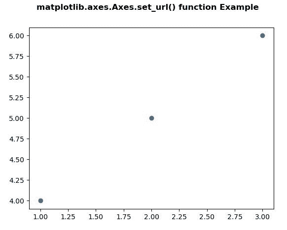
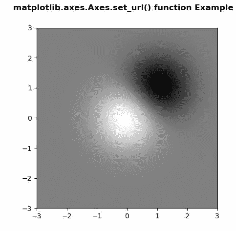

# matplotlib . axes . set _ URL()用 Python

表示

> 原文:[https://www . geeksforgeeks . org/matplotlib-axes-axes-set _ URL-in-python/](https://www.geeksforgeeks.org/matplotlib-axes-axes-set_url-in-python/)

**[Matplotlib](https://www.geeksforgeeks.org/python-introduction-matplotlib/)** 是 Python 中的一个库，是 NumPy 库的数值-数学扩展。**轴类**包含了大部分的图形元素:轴、刻度、线二维、文本、多边形等。，并设置坐标系。Axes 的实例通过回调属性支持回调。

## matplotlib.axes.Axes.set_url()函数

matplotlib 库的 Axes 模块中的 **Axes.set_url()函数**用于为艺术家设置 url。

> **语法:** Axes.set_url(self，url)
> 
> **参数:**该方法只接受一个参数。
> 
> *   **url :** 此参数是包含 url 的字符串。
> 
> **返回:**该方法不返回值。

下面的例子说明了 matplotlib.axes.Axes.set_url()函数在 matplotlib.axes 中的作用:

**例 1:**

```py
# Implementation of matplotlib function  
import numpy as np
import matplotlib.cm as cm
import matplotlib.mlab as mlab
import matplotlib.pyplot as plt

f, ax = plt.subplots()
s = ax.scatter([1, 2, 3], [4, 5, 6])
s.set_url('http://www.google.com')
f.canvas.print_figure('scatter.svg')

f.suptitle('matplotlib.axes.Axes.set_url() function\
 Example\n', fontweight ="bold")

plt.show()
```

**输出:**


**示例-2:**

```py
# Implementation of matplotlib function  
import numpy as np
import matplotlib.cm as cm
import matplotlib.mlab as mlab
import matplotlib.pyplot as plt

f, ax = plt.subplots()
delta = 0.025
x = y = np.arange(-3.0, 3.0, delta)
X, Y = np.meshgrid(x, y)
Z1 = np.exp(-X**2 - Y**2)
Z2 = np.exp(-(X - 1)**2 - (Y - 1)**2)
Z = (Z1 - Z2) * 2

im = ax.imshow(Z, interpolation ='bilinear',
               cmap = cm.gray,
               origin ='lower', 
               extent =[-3, 3, -3, 3])

im.set_url('https://www.geeksforgeeks.org/')
f.savefig('image.svg')

f.suptitle('matplotlib.axes.Axes.set_url() function \
Example\n', fontweight ="bold")

plt.show()
```

**输出:**
