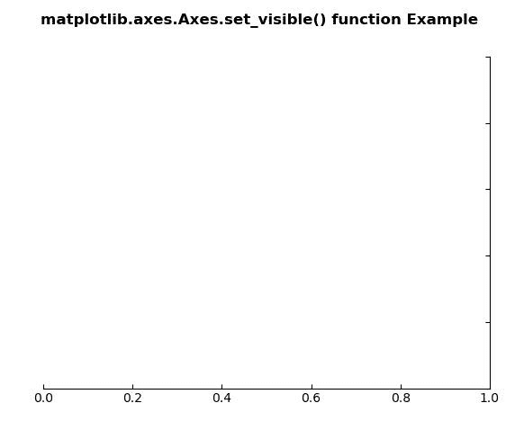
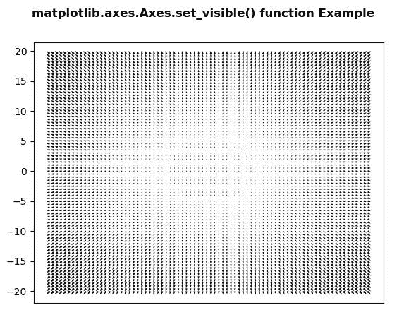

# Python 中的 matplotlib . axes . axes . set _ visible()

> 原文:[https://www . geeksforgeeks . org/matplotlib-axes-axes-set _ visible-in-python/](https://www.geeksforgeeks.org/matplotlib-axes-axes-set_visible-in-python/)

**[Matplotlib](https://www.geeksforgeeks.org/python-introduction-matplotlib/)** 是 Python 中的一个库，是 NumPy 库的数值-数学扩展。**轴类**包含了大部分的图形元素:轴、刻度、线二维、文本、多边形等。，并设置坐标系。Axes 的实例通过回调属性支持回调。

## matplotlib . axes . axes . set _ visible()函数

matplotlib 库的 Axes 模块中的 **Axes.set_visible()函数**用于设置艺术家的可见性。

> **语法:** Axes.set_visible(self，b)
> 
> **参数:**该方法只接受一个参数。
> 
> *   **b:** 该参数为布尔值。
> 
> **返回:**该方法不返回值。

下面的例子说明了 matplotlib.axes . axes . set _ visible()函数在 matplotlib . axes 中的作用:

**例 1:**

```
# Implementation of matplotlib function
import matplotlib.pyplot as plt
from mpl_toolkits.axisartist.axislines import Subplot

fig = plt.figure()

ax = Subplot(fig, 111)
fig.add_subplot(ax)

ax.axis["left"].set_visible(False)
ax.axis["top"].set_visible(False)

fig.suptitle('matplotlib.axes.Axes.set_visible()\
 function Example\n', fontweight ="bold")

plt.show()
```

**输出:**


**示例-2:**

```
# Implementation of matplotlib function
import matplotlib.pyplot as plt
import numpy as np

X = np.arange(-20, 20, 0.5)
Y = np.arange(-20, 20, 0.5)
U, V = np.meshgrid(X, Y)

fig, ax = plt.subplots()
ax.quiver(X, Y, U, V)
w = ax.get_xaxis()
w.set_visible(False)

fig.suptitle('matplotlib.axes.Axes.set_visible() \
function Example\n', fontweight ="bold")

plt.show()
```

**输出:**
