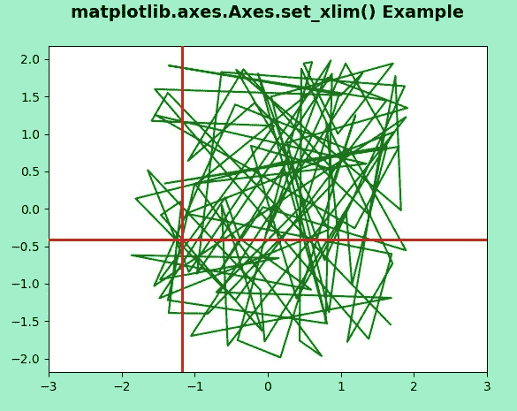
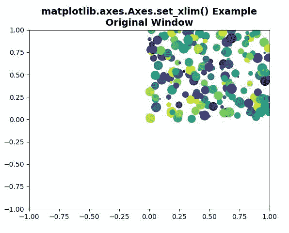
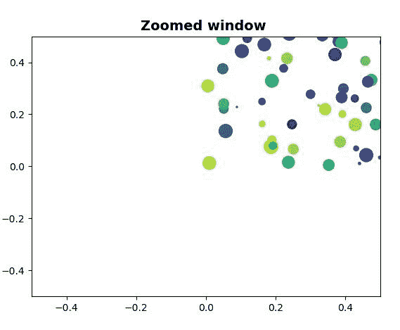

# matplotlib . axes . set _ xlim()用 Python

表示

> 哎哎哎:# t0]https://www . geeksforgeeks . org/matplotlib-axes-set _ xlim-in-python/

**[Matplotlib](https://www.geeksforgeeks.org/python-introduction-matplotlib/)** 是 Python 中的一个库，是 NumPy 库的数值-数学扩展。**轴类**包含了大部分的图形元素:轴、刻度、线二维、文本、多边形等。，并设置坐标系。Axes 的实例通过回调属性支持回调。

**matplotlib.axes.Axes.set_xlim() Function:**

matplotlib 库的 Axes 模块中的 **Axes.set_xlim()函数**用于设置 x 轴视图限制。

> **语法:** Axes.set_xlim(self，左=无，右=无，emit =真，auto =假，* xmin =无，xmax =无)
> 
> **参数:**该方法接受以下参数。
> 
> *   **左:**此参数是数据坐标中的左 xlim
> *   **右:**此参数是数据坐标中的右 xlim
> *   **发出:**此参数用于通知观察者极限变化。
> *   **自动:**该参数用于开启 x 轴的自动缩放。
> *   **xmin，xmax:** 这些参数相当于左和右，同时传递 xmin 和左或者 xmax 和右都是错误的。
> 
> **返回:**该方法返回以下内容
> 
> *   **左，右:**这将返回数据坐标中的新 x 轴限制。

下面的例子说明了 matplotlib.axes.Axes.set_xlim()函数在 matplotlib.axes 中的作用:

**例 1:**

```
# Implementation of matplotlib function
from matplotlib.widgets import Cursor
import numpy as np
import matplotlib.pyplot as plt

np.random.seed(19680801)

fig, ax = plt.subplots(facecolor ='#A0F0CC')

x, y = 4*(np.random.rand(2, 100) - .5)
ax.plot(x, y, 'g')
ax.set_xlim(-3, 3)

cursor = Cursor(ax, useblit = True, color ='red', 
                linewidth = 2)

ax.set_title('matplotlib.axes.Axes.set_xlim() \
Example\n', fontsize = 14, fontweight ='bold')
plt.show()
```

**输出:**


**例 2:**

```
# Implementation of matplotlib function
import matplotlib.pyplot as plt
import numpy as np

fig1, ax1 = plt.subplots()
fig2, ax2 = plt.subplots()
ax1.set(xlim =(-1.0, 1.0), 
        ylim =(-1.0, 1.0),
        autoscale_on = False)

ax2.set(xlim =(-0.5, 0.5), 
        ylim =(-0.5, 0.5),
        autoscale_on = False)

x, y, s, c = np.random.rand(4, 200)
s *= 200

ax1.scatter(x, y, s, c)
ax2.scatter(x, y, s, c)

def GFG(event):

    if event.button != 1:
        return

    x, y = event.xdata, event.ydata
    ax2.set_xlim(x - 0.5, x + 0.5)
    ax2.set_ylim(y - 0.5, y + 0.5)
    fig2.canvas.draw()

fig1.canvas.mpl_connect('button_press_event',
                        GFG)   
ax1.set_title('matplotlib.axes.Axes.set_xlim() \
Example\n Original Window ',
             fontsize = 14, fontweight ='bold')

ax2.set_title('Zoomed Window',
             fontsize = 14, fontweight ='bold')

plt.show()
```

**输出:**

