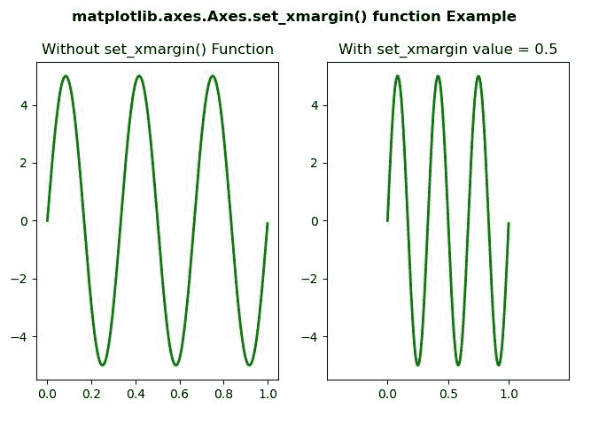
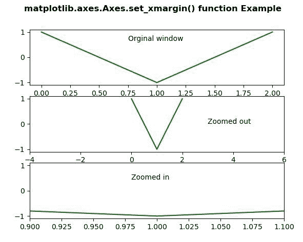

# matplotlib . axes . set _ xmargin()用 Python

表示

> 原文:[https://www . geeksforgeeks . org/matplotlib-axes-axes-set _ xmargin-in-python/](https://www.geeksforgeeks.org/matplotlib-axes-axes-set_xmargin-in-python/)

[**Matplotlib**](https://www.geeksforgeeks.org/python-introduction-matplotlib/) 是 Python 中的一个库，是 NumPy 库的数值-数学扩展。**轴类**包含了大部分的图形元素:轴、刻度、线二维、文本、多边形等。，并设置坐标系。Axes 的实例通过回调属性支持回调。

matplotlib.axes.Axes.set_xmargin() Function

matplotlib 库的 Axes 模块中的 **Axes.set_xmargin()函数**用于在自动缩放之前设置 X 数据限制的填充。

> **语法:** Axes.set_xmargin(self，m)
> **参数:**此方法接受以下参数。
> 
> *   **m:** 此参数用于 x 轴的特定余量值。
> 
> **返回值:**此方法不返回值。

下面的例子说明了 matplotlib.axes . axes . set _ xmargin()函数在 matplotlib . axes 中的作用:

**例 1:**

## 蟒蛇 3

```
# Implementation of matplotlib function 
import numpy as np
import matplotlib.pyplot as plt
from matplotlib.widgets import Slider, Button, RadioButtons

fig, (ax, ax1) = plt.subplots(1, 2)
plt.subplots_adjust(bottom = 0.25)
t = np.arange(0.0, 1.0, 0.001)
a0 = 5
f0 = 3
delta_f = 5.0
s = a0 * np.sin(2 * np.pi * f0 * t)
ax.plot(t, s, lw = 2, color = 'green')

ax1.plot(t, s, lw = 2, color = 'green')
ax1.set_xmargin(0.5)

ax.set_title("Without set_xmargin() Function")
ax1.set_title("With set_xmargin value = 0.5")

fig.suptitle('matplotlib.axes.Axes.set_xmargin() \
function Example\n', fontweight ="bold")
fig.canvas.draw()
plt.show()
```

**输出:**



**例 2:**

## 蟒蛇 3

```
# Implementation of matplotlib function 
import numpy as np
import matplotlib.pyplot as plt

t = np.arange(0, 3, 1)
t1 = np.cos(np.pi * t) + np.sin(np.pi * t)

fig, [ax1, ax2, ax3] = plt.subplots(nrows = 3)
ax1.plot(t1, color ="green")
ax1.text(0.75, 0.65, 'Original window')

ax2.set_xmargin(2)
ax2.plot(t1, color ="green")
ax2.text(3, 0, 'Zoomed out')

ax3.set_xmargin(-0.45)
ax3.plot(t1, color ="green")
ax3.text(0.98, 0.45, 'Zoomed in')

fig.suptitle('matplotlib.axes.Axes.set_xmargin() \
function Example\n', fontweight ="bold")
fig.canvas.draw()
plt.show()
```

**输出:**

