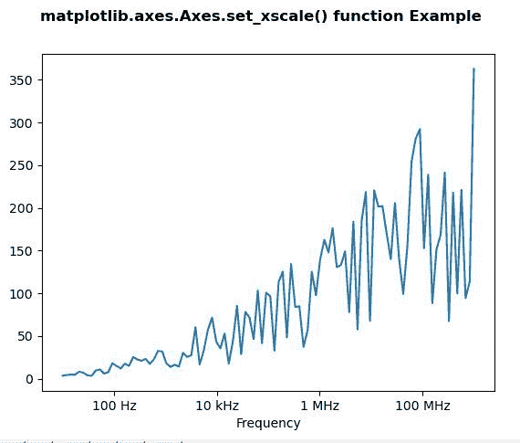
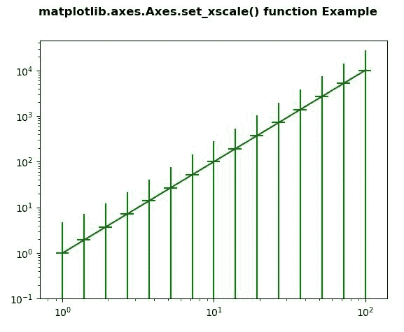

# matplotlib . axes . set _ xscale()用 Python

表示

> 原文:[https://www . geeksforgeeks . org/matplotlib-axes-axes-set _ xscale-in-python/](https://www.geeksforgeeks.org/matplotlib-axes-axes-set_xscale-in-python/)

**[Matplotlib](https://www.geeksforgeeks.org/python-introduction-matplotlib/)** 是 Python 中的一个库，是 NumPy 库的数值-数学扩展。**轴类**包含了大部分的图形元素:轴、刻度、线二维、文本、多边形等。，并设置坐标系。Axes 的实例通过回调属性支持回调。

## matplotlib . axes . axes . set _ xscale()函数

matplotlib 库的 Axes 模块中的 **Axes.set_xscale()函数**用于设置 x 轴比例。

> **语法:** Axes.set_xscale(self，value，**kwargs)
> 
> **参数:**该方法接受以下参数。
> 
> *   **值:**此参数是要应用的轴比例类型。
> *   ****kwargs:** 有不同的关键字参数被接受，其取决于规模。

下面的例子说明了 matplotlib.axes . axes . set _ xscale()函数在 matplotlib . axes 中的作用:

**例 1:**

```
# Implementation of matplotlib function
import matplotlib.pyplot as plt
import numpy as np
from matplotlib.ticker import EngFormatter

val = np.random.RandomState(19680801)
xs = np.logspace(1, 9, 100)
ys = (0.8 + 4 * val.uniform(size = 100)) * np.log10(xs)**2

fig, ax0 = plt.subplots()
ax0.set_xscale('log')
formatter0 = EngFormatter(unit ='Hz')
ax0.xaxis.set_major_formatter(formatter0)
ax0.plot(xs, ys)
ax0.set_xlabel('Frequency')

fig.suptitle('matplotlib.axes.Axes.set_xscale() \
function Example\n', fontweight ="bold")

plt.show()
```

**输出:**


**例 2:**

```
# Implementation of matplotlib function
import numpy as np
import matplotlib.pyplot as plt

fig, ax4 = plt.subplots()

x = 10.0**np.linspace(0.0, 2.0, 15)
y = x**2.0
ax4.set_xscale("log", nonposx ='clip')
ax4.set_yscale("log", nonposy ='clip')

ax4.errorbar(x, y, xerr = 0.1 * x,
             yerr = 2.0 + 1.75 * y, 
             color ="green")

ax4.set_ylim(bottom = 0.1)

fig.suptitle('matplotlib.axes.Axes.set_xscale()\
 function Example\n', fontweight ="bold")

plt.show()
```

**输出:**
