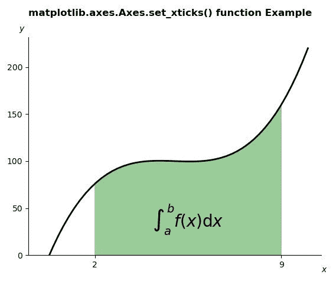
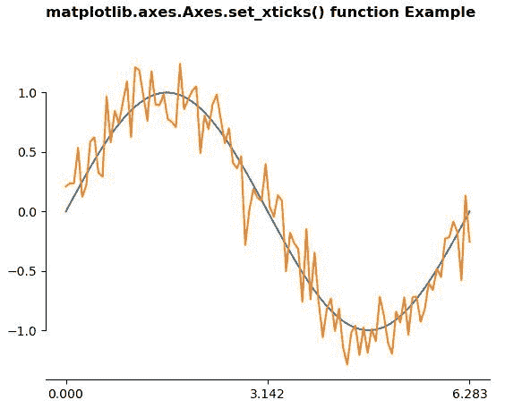

# matplotlib . axes . set _ xts()用 Python

表示

> 哎哎哎:# t0]https://www . geeksforgeeks . org/matplotlib-axes-set _ xts-in-python/

**[Matplotlib](https://www.geeksforgeeks.org/python-introduction-matplotlib/)** 是 Python 中的一个库，是 NumPy 库的数值-数学扩展。**轴类**包含了大部分的图形元素:轴、刻度、线二维、文本、多边形等。，并设置坐标系。Axes 的实例通过回调属性支持回调。

## matplotlib . axes . axes . set _ xtpicks()函数

matplotlib 库的 Axes 模块中的**axes . Set _ xtpicks()函数**用于设置带有刻度列表的 x 刻度。

> **语法:**axes . set _ xtpicks(self，ticks，minor=False)
> 
> **参数:**该方法接受以下参数。
> 
> *   **刻度:**该参数是 x 轴刻度位置的列表。
> *   **次要:**此参数用于设置主要刻度还是次要刻度
> 
> **返回值:**此方法不返回值。

下面的例子说明了 matplotlib.axes . axes . set _ xtpicks()函数在 matplotlib . axes 中的作用:

**例 1:**

```py
# Implementation of matplotlib function
import numpy as np
import matplotlib.pyplot as plt
from matplotlib.patches import Polygon

def func(x):
    return (x - 4) * (x - 6) * (x - 5) + 100

a, b = 2, 9  # integral limits
x = np.linspace(0, 10)
y = func(x)

fig, ax = plt.subplots()
ax.plot(x, y, "k", linewidth = 2)
ax.set_ylim(bottom = 0)

# Make the shaded region
ix = np.linspace(a, b)
iy = func(ix)
verts = [(a, 0), *zip(ix, iy), (b, 0)]
poly = Polygon(verts, facecolor ='green',
               edgecolor ='0.5', alpha = 0.4)
ax.add_patch(poly)

ax.text(0.5 * (a + b), 30,
        r"$\int_a ^ b f(x)\mathrm{d}x{content}quot;,
        horizontalalignment ='center',
        fontsize = 20)

fig.text(0.9, 0.05, '$x{content}apos;)
fig.text(0.1, 0.9, '$y{content}apos;)

ax.spines['right'].set_visible(False)
ax.spines['top'].set_visible(False) 
ax.set_xticks((a, b))

fig.suptitle('matplotlib.axes.Axes.set_xticks()\
 function Example\n\n', fontweight ="bold")
fig.canvas.draw()
plt.show()
```

**输出:**


**例 2:**

```py
# Implementation of matplotlib function
import numpy as np
import matplotlib.pyplot as plt

# Fixing random state for reproducibility
np.random.seed(19680801)

x = np.linspace(0, 2 * np.pi, 100)
y = np.sin(x)
y2 = y + 0.2 * np.random.normal(size = x.shape)

fig, ax = plt.subplots()
ax.plot(x, y)
ax.plot(x, y2)

ax.set_xticks([0, np.pi, 2 * np.pi])

ax.spines['left'].set_bounds(-1, 1)
ax.spines['right'].set_visible(False)
ax.spines['top'].set_visible(False)

fig.suptitle('matplotlib.axes.Axes.set_xticks() \
function Example\n\n', fontweight ="bold")
fig.canvas.draw()
plt.show()
```

**输出:**
