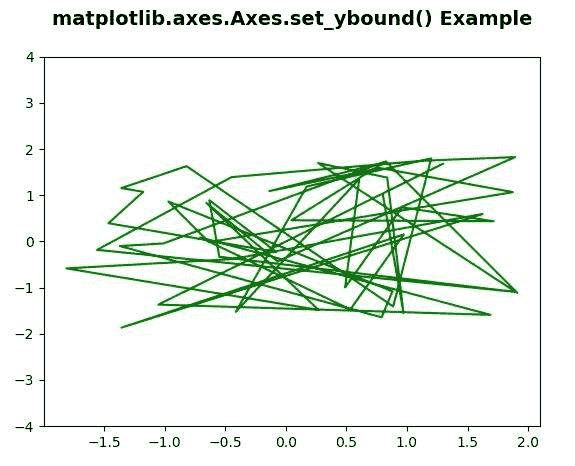
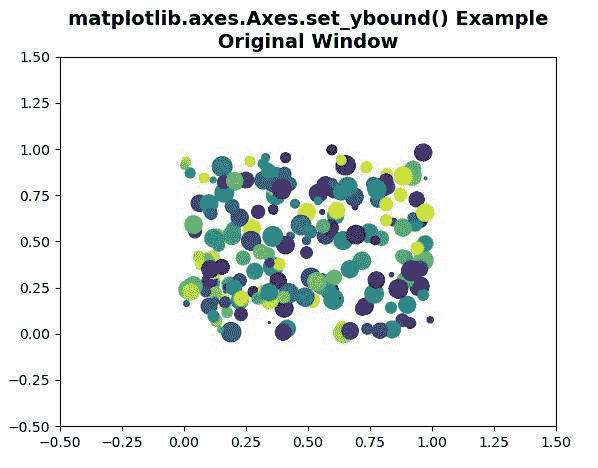
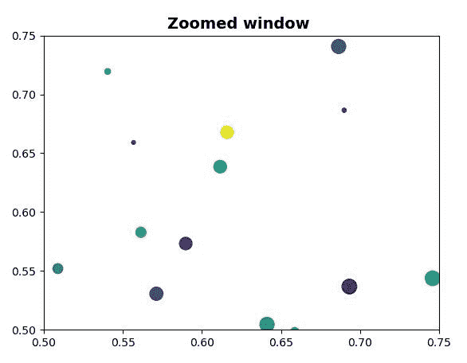

# Python 中的 matplotlib . axes . axes . set _ ybound()

> 原文:[https://www . geeksforgeeks . org/matplotlib-axes-axes-set _ ybound-in-python/](https://www.geeksforgeeks.org/matplotlib-axes-axes-set_ybound-in-python/)

**[Matplotlib](https://www.geeksforgeeks.org/python-introduction-matplotlib/)** 是 Python 中的一个库，是 NumPy 库的数值-数学扩展。**轴类**包含了大部分的图形元素:轴、刻度、线二维、文本、多边形等。，并设置坐标系。Axes 的实例通过回调属性支持回调。

## matplotlib . axes . axes . set _ ybound()函数

matplotlib 库的 Axes 模块中的 **Axes.set_ybound()函数**用于设置 y 轴的数值上下限。

> **语法:** Axes.set_ybound(自身，下=无，上=无)
> 
> **参数:**该方法接受以下参数。
> 
> *   **下限，上限:**这些参数是下限和上限。如果为“无”，则不修改相应的轴边界。
> 
> **返回:**该方法返回以下内容
> 
> *   **下限、上限:**这将返回新的 y 轴下限和上限。

**注意:**该功能可以在各种条件下代替 set_ylim 使用。

下面的例子说明了 matplotlib.axes . axes . set _ ybound()函数在 matplotlib . axes 中的作用:

**例 1:**

```
# Implementation of matplotlib function
from matplotlib.widgets import Cursor
import numpy as np
import matplotlib.pyplot as plt

np.random.seed(19680801)

fig, ax = plt.subplots()

x, y = 4*(np.random.rand(2, 50) - .5)
ax.plot(x, y, 'g')
ax.set_ybound(-4, 4)

ax.set_title('matplotlib.axes.Axes.set_ybound() Example\n',
             fontsize = 14, fontweight ='bold')
plt.show()
```

**输出:**


**例 2:**

```
# Implementation of matplotlib function
import matplotlib.pyplot as plt
import numpy as np

fig1, ax1 = plt.subplots()
fig2, ax2 = plt.subplots()
ax1.set(xlim =(-0.5, 1.5), ylim =(-0.5, 1.5), 
        autoscale_on = False)

ax2.set(xlim =(0.5, 0.75), ylim =(0.5, 0.75),
        autoscale_on = False)

x, y, s, c = np.random.rand(4, 200)
s *= 200

ax1.scatter(x, y, s, c)
ax2.scatter(x, y, s, c)

def GFG(event):

    if event.button != 1:
        return

    x, y = event.xdata, event.ydata
    ax2.set_xbound(x - 0.1, x + 0.1)
    ax2.set_ybound(y - 0.2, y + 0.2)
    fig2.canvas.draw()

fig1.canvas.mpl_connect('button_press_event', GFG)   
ax1.set_title('matplotlib.axes.Axes.set_ybound()\
 Example\n Original Window ',
             fontsize = 14, fontweight ='bold')

ax2.set_title('Zoomed window ',
             fontsize = 14, fontweight ='bold')
plt.show()
```

**输出:**


