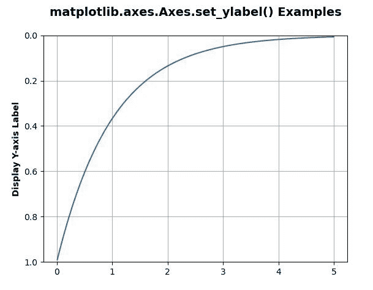
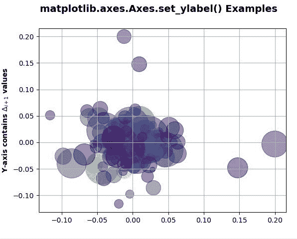

# matplotlib . axes . set _ ylabel()用 Python

表示

> 哎哎哎:# t0]https://www . geeksforgeeks . org/matplotlib-axes-set _ ylabel-in-python/

**[Matplotlib](https://www.geeksforgeeks.org/python-introduction-matplotlib/)** 是 Python 中的一个库，是 NumPy 库的数值-数学扩展。**轴类**包含了大部分的图形元素:轴、刻度、线二维、文本、多边形等。，并设置坐标系。Axes 的实例通过回调属性支持回调。

## matplotlib . axes . axes . set _ ylabel()函数

matplotlib 库的 Axes 模块中的 **Axes.set_ylabel()函数**用于设置 y 轴的标签。

> **语法:** Axes.set_ylabel(self，xlabel，fontdict=None，labelpad=None，**kwargs)
> 
> **参数:**该方法接受以下参数。
> 
> *   **依拉贝尔:**该参数为标签文本。
> *   **labelpad :** 此参数是距离轴边界框的点间距，包括刻度和刻度标签。
> 
> **返回:**此方法不返回任何值。

下面的例子说明了 matplotlib.axes . axes . set _ ylabel()函数在 matplotlib . axes 中的作用:

**例 1:**

```
import matplotlib.pyplot as plt
import numpy as np

t = np.arange(0.01, 5.0, 0.01)
s = np.exp(-t)

fig, ax = plt.subplots()

ax.plot(t, s)
ax.set_ylim(1, 0)
ax.set_ylabel('Display Y-axis Label', 
              fontweight ='bold')
ax.grid(True)

ax.set_title('matplotlib.axes.Axes.set_ylabel() \
Examples\n', fontsize = 14, fontweight ='bold')
plt.show()
```

**输出:**


**例 2:**

```
#Implementation of matplotlib function
import numpy as np
import matplotlib.pyplot as plt
import matplotlib.cbook as cbook

with cbook.get_sample_data('goog.npz') as datafile:
    price_data = np.load(datafile)['price_data'].view(np.recarray)

# get the most recent 250 
# trading days
price_data = price_data[-250:]  

delta1 = np.diff(price_data.adj_close) / price_data.adj_close[:-1]

volume = (25 * price_data.volume[:-2] / price_data.volume[0])**(2.2)
close = (0.03 * price_data.close[:-2] / 0.03 * price_data.open[:-2])**2

fig, ax = plt.subplots()
ax.scatter(delta1[:-1], delta1[1:],
           c=close, s=volume,
           alpha=0.5)

ax.set_ylabel(r'Y-axis contains $\Delta_{i+1}$ values',
              fontweight='bold')
ax.grid(True)
fig.suptitle('matplotlib.axes.Axes.set_ylabel() Examples\n',
             fontsize=14, fontweight='bold')
plt.show()
```

**输出:**
