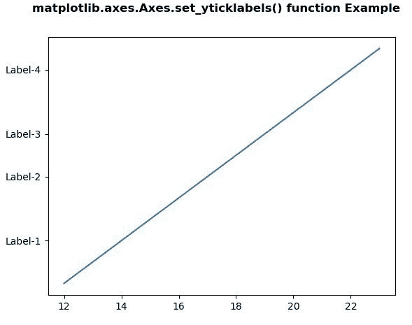
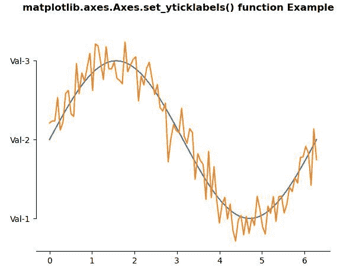

# matplotlib . axes . set _ yticklabels()用 Python

表示

> 哎哎哎:# t0]https://www . geeksforgeeks . org/matplotlib-axes-set _ yticklabels-in-python/

**[Matplotlib](https://www.geeksforgeeks.org/python-introduction-matplotlib/)** 是 Python 中的一个库，是 NumPy 库的数值-数学扩展。**轴类**包含了大部分的图形元素:轴、刻度、线二维、文本、多边形等。，并设置坐标系。Axes 的实例通过回调属性支持回调。

## matplotlib . axes . axes . set _ yticklabels()函数

matplotlib 库的 Axes 模块中的 **Axes.set_yticklabels()函数**用于设置带有字符串标签列表的 y 刻度标签。

> **语法:** Axes.set_yticklabels(self，labels，fontdict=None，minor=False，**kwargs)
> 
> **参数:**该方法接受以下参数。
> 
> *   **标签:**该参数是字符串标签的列表。
> *   **fontdict :** 该参数是控制 ticklabels 外观的字典。
> *   **次要:**此参数用于设置主要刻度还是次要刻度
> 
> **返回值:**这个方法返回一个文本实例列表。

下面的例子说明了 matplotlib.axes . axes . set _ yticklabels()函数在 matplotlib . axes 中的作用:

**例 1:**

```py
# Implementation of matplotlib function
import matplotlib.pyplot as plt
import matplotlib.transforms as mtransforms

fig, ax = plt.subplots()
ax.plot(range(12, 24), range(12))
ax.set_yticks((2, 5, 7, 10))
ax.set_yticklabels(("Label-1", "Label-2",
                    "Label-3", "Label-4"))

fig.suptitle('matplotlib.axes.Axes.set_yticklabels()\
 function Example\n\n', fontweight ="bold")
fig.canvas.draw()
plt.show()
```

**输出:**


**例 2:**

```py
# Implementation of matplotlib function
import numpy as np
import matplotlib.pyplot as plt

# Fixing random state for reproducibility
np.random.seed(19680801)

x = np.linspace(0, 2 * np.pi, 100)
y = np.sin(x)
y2 = y + 0.2 * np.random.normal(size = x.shape)

fig, ax = plt.subplots()
ax.plot(x, y)
ax.plot(x, y2)

ax.set_yticks([-1, 0, 1])

ax.spines['left'].set_bounds(-1, 1)
ax.spines['right'].set_visible(False)
ax.spines['top'].set_visible(False)

ax.set_yticklabels(("Val-1", "Val-2", "Val-3"))

fig.suptitle('matplotlib.axes.Axes.set_yticklabels()\
 function Example\n\n', fontweight ="bold")
fig.canvas.draw()
plt.show()
```

**输出:**
