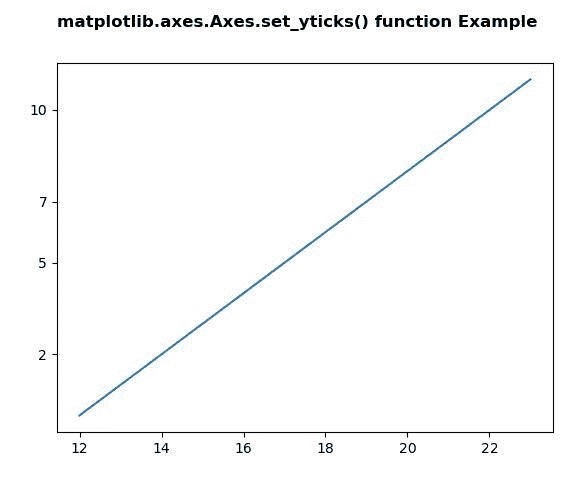

# python 中的 matplotlib . axes . set _ ytick()

> 原文:[https://www . geeksforgeeks . org/matplotlib-axes-axes-set _ yticks-in-python/](https://www.geeksforgeeks.org/matplotlib-axes-axes-set_yticks-in-python/)

**[Matplotlib](https://www.geeksforgeeks.org/python-introduction-matplotlib/)** 是 Python 中的一个库，是 NumPy 库的数值-数学扩展。**轴类**包含了大部分的图形元素:轴、刻度、线二维、文本、多边形等。，并设置坐标系。Axes 的实例通过回调属性支持回调。

## matplotlib . axes . axes . set _ yticks()函数

matplotlib 库的 Axes 模块中的 **Axes.set_yticks()函数**用于设置带有刻度列表的 y 刻度。

> **语法:** Axes.set_yticks(self，ticks，minor=False)
> 
> **参数:**该方法接受以下参数。
> 
> *   **刻度:**此参数是 y 轴刻度位置的列表。
> *   **次要:**此参数用于设置主要刻度还是次要刻度
> 
> **返回值:**此方法不返回值。

下面的例子说明了 matplotlib.axes . axes . set _ yticks()函数在 matplotlib . axes 中的作用:

**例 1:**

```
# Implementation of matplotlib function
import matplotlib.pyplot as plt
import matplotlib.transforms as mtransforms

fig, ax = plt.subplots()
ax.plot(range(12, 24), range(12))
ax.set_yticks((2, 5, 7, 10))

fig.suptitle('matplotlib.axes.Axes.set_yticks()\
 function Example\n\n', fontweight ="bold")
plt.show()
```

**输出:**


**例 2:**

```
# Implementation of matplotlib function
import numpy as np
import matplotlib.pyplot as plt

# Fixing random state for reproducibility
np.random.seed(19680801)

x = np.linspace(0, 2 * np.pi, 100)
y = np.sin(x)
y2 = y + 0.2 * np.random.normal(size = x.shape)

fig, ax = plt.subplots()
ax.plot(x, y)
ax.plot(x, y2)

ax.set_yticks([-1, 0, 1])

ax.spines['left'].set_bounds(-1, 1)
ax.spines['right'].set_visible(False)
ax.spines['top'].set_visible(False)

fig.suptitle('matplotlib.axes.Axes.set_yticks()\
 function Example\n\n', fontweight ="bold")
fig.canvas.draw()
plt.show()
```

**输出:**
