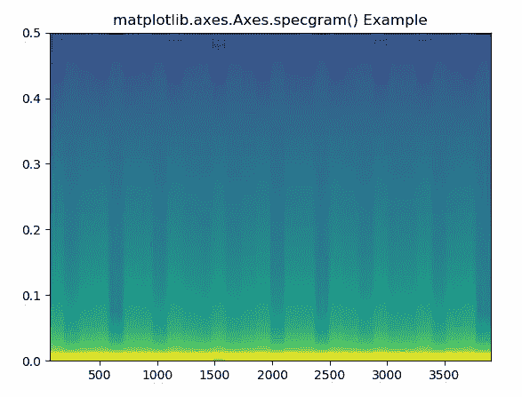

# matplotlib . axes . specgram()中的 Python

> 哎哎哎:# t0]https://www . geeksforgeeks . org/matplot lib-axes-specgram-in-python/

**[Matplotlib](https://www.geeksforgeeks.org/python-introduction-matplotlib/)** 是 Python 中的一个库，是 NumPy 库的数值-数学扩展。**轴类**包含了大部分的图形元素:轴、刻度、线二维、文本、多边形等。，并设置坐标系。Axes 的实例通过回调属性支持回调。

## matplotlib.axes.Axes.specgram()函数

matplotlib 库的 Axes 模块中的 **Axes.specgram()函数**用于绘制谱图。

> **语法:** Axes.specgram(self，x，NFFT =无，Fs =无，Fc =无，detrend =无，window =无，noverlap =无，cmap =无，xextent =无，pad _ to =无，sides =无，scale _ by _ freq =无，mode =无，scale =无，vmin =无，vmax =无，* data =无，* * * kwargs)
> 
> **参数:**该方法接受以下描述的参数:
> 
> *   **x:** 这个参数是一个数据序列。
> *   **Fs :** 此参数为标量。它的默认值是 2。
> *   **窗口:**该参数以一个数据段为自变量，返回该段的窗口版本。其默认值为 *window_hanning()*
> *   **边:**此参数指定要返回光谱的哪些边。这可以有以下值:“默认值”、“单侧”和“双侧”。
> *   **pad_to :** 此参数包含数据段填充到的整数值。
> *   **Fc:** 该参数还包含偏移绘图 x 范围的整数值，以反映频率范围。其默认值为 *0*
> *   **NFFT :** 该参数包含用于快速傅立叶变换的每个块中的数据点数。
> *   **去趋势:**此参数包含在 fft 之前应用于每个分段的函数，旨在移除均值或线性趋势{ '无'，'均值'，'线性' }。
> *   **scale_by_freq :** 该参数允许对返回的频率值进行积分。
> *   **模式:**这个参数就是用什么样的频谱{ '默认'，' psd '，'幅度'，'角度'，'相位' }。
> *   **noverlap :** 此参数是块之间重叠的点数。
> *   **比例:**此参数包含规格{ '默认值'，'线性'，'分贝' }中值的比例。
> *   **Fc :** 该参数为 x 的中心频率。
> *   **camp:** 这个参数是 matplotlib.colors.Colormap 实例。
> 
> **返回:**这将返回以下内容:
> 
> *   **光谱:**以弧度为单位返回角度光谱。
> *   **频率:**返回频谱中元素对应的频率。
> *   **t:** 返回线段中点对应的时间。
> *   **im:** 返回 imshow 创建的包含谱图的图像。
> 
> 结果是**(光谱，频率，t，im)**

下面的例子说明了 matplotlib.axes.Axes.specgram()函数在 matplotlib.axes 中的作用:

**示例-1:**

```py
# Implementation of matplotlib function
import matplotlib.pyplot as plt
import numpy as np

dt = 0.005
t = np.arange(0.0, 20.0, dt)
x = np.sin(np.pi * t) + 1.5 * np.cos(np.pi * t)

fig, ax1 = plt.subplots()
ax1.specgram(x, Fs = 1)
ax1.set_title('matplotlib.axes.Axes.specgram() Example')

plt.show()
```

**输出:**


**示例-2:**

```py
# Implementation of matplotlib function
import matplotlib.pyplot as plt
import numpy as np

np.random.seed(9360801)

dt = 0.0005
t = np.arange(0.0, 20.0, dt)
s1 = np.sin(4 * np.pi * 100 * t)
s2 = 1.5 * np.sin(1.5 * np.pi * 400 * t)

s2[t <= 10] = s2[12 <= t] = 0

nse = 0.2 * np.random.random(size = len(t))

x = s1 + s2 + nse  
NFFT = 512 
Fs = int(1.0 / dt)  

fig, ax1 = plt.subplots()
ax1.specgram(x, Fs = Fs, cmap = plt.cm.bone)
ax1.set_title('matplotlib.axes.Axes.specgram() Example')

plt.show()
```

**输出:**
