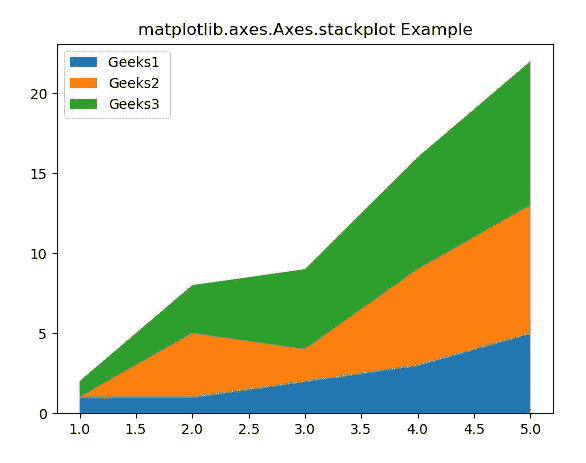
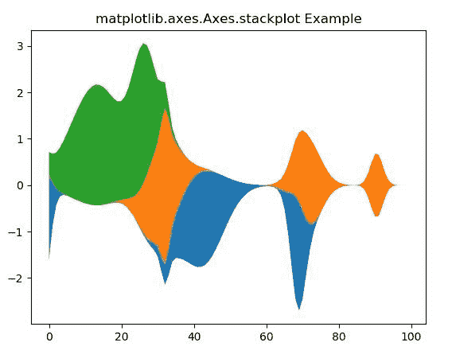

# matplot lib . axes . axes . stack plot()在 Python

中

> 哎哎哎:# t0]https://www . geeksforgeeks . org/matplot lib-axes-stack plot-in-python/

**[Matplotlib](https://www.geeksforgeeks.org/python-introduction-matplotlib/)** 是 Python 中的一个库，是 NumPy 库的数值-数学扩展。**轴类**包含了大部分的图形元素:轴、刻度、线二维、文本、多边形等。，并设置坐标系。Axes 的实例通过回调属性支持回调。

## matplotlib.axes.Axes.stackplot()函数

matplotlib 库的 Axes 模块中的**axes . stack lot()函数**用于创建堆叠区域 plo。

> **语法:** Axes.stackplot(axes，x，*args，labels=()，colors=None，baseline='zero '，data=None，**kwargs)
> 
> **参数:**该方法接受以下描述的参数:
> 
> *   **x:** 这个参数是 x 坐标的序列。
> *   **y:** 这个参数是 y 坐标的序列。
> *   **基线:**此参数为基线{'zero '，' sym '，' wiggle '，' weighted_wiggle'}。
> *   **颜色:**该参数是颜色的列表或元组。
> *   **标签:**此参数是分配给每个数据系列的标签。
> 
> **返回:**这将返回以下内容:
> 
> *   **列表:**这将返回多集合实例列表，堆叠区域图中的每个元素对应一个实例。

下面的例子说明了 matplotlib.axes.Axes.stackplot()函数在 matplotlib.axes 中的作用:

**示例-1:**

```
# Implementation of matplotlib function
import numpy as np
import matplotlib.pyplot as plt

x = [1, 2, 3, 4, 5]
y1 = [1, 1, 2, 3, 5]
y2 = [0, 4, 2, 6, 8]
y3 = [1, 3, 5, 7, 9]

y = np.vstack([y1, y2, y3])

labels = ["Geeks1 ", "Geeks2", "Geeks3"]

fig, ax = plt.subplots()
ax.stackplot(x, y1, y2, y3, 
             labels = labels)

ax.legend(loc ='upper left')

ax.set_title('matplotlib.axes.Axes.stackplot Example')
plt.show()
```

**输出:**


**示例-2:**

```
# Implementation of matplotlib function
import numpy as np
import matplotlib.pyplot as plt

def GFG(n, m):

    def geeks(a):
        x = 1 / (.1 + np.random.random())
        y = 2 * np.random.random() - .5
        z = 10 / (.1 + np.random.random())

        for i in range(m):
            w = (i / m - y) * z
            a[i] += x * np.exp(-w * w)

    a = np.zeros((m, n))

    for i in range(n):
        for j in range(5):
            geeks(a[:, i])

    return a

test = GFG(3, 100)

fig, ax = plt.subplots()
ax.stackplot(range(100), test.T,
             baseline ='wiggle')

ax.set_title('matplotlib.axes.Axes.stackplot Example')
plt.show()
```

