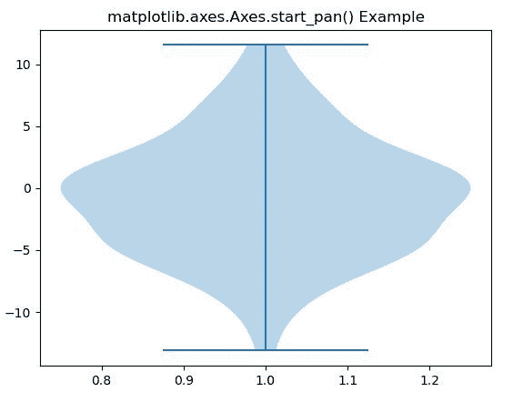
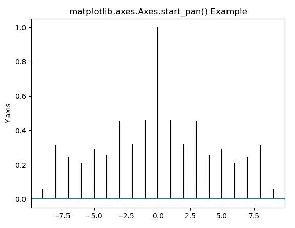

# Python 中的 Matplotlib.axes.Axes.start_pan()

> 原文:[https://www . geeksforgeeks . org/matplotlib-axes-axes-start _ pan-in-python/](https://www.geeksforgeeks.org/matplotlib-axes-axes-start_pan-in-python/)

[**Matplotlib**](https://www.geeksforgeeks.org/python-introduction-matplotlib/) 是 Python 中的一个库，是 NumPy 库的数值-数学扩展。**轴类**包含了大部分的图形元素:轴、刻度、线二维、文本、多边形等。，并设置坐标系。Axes 的实例通过回调属性支持回调。

### matplotlib.axes.Axes.start_pan()函数

当平移操作开始时，调用 matplotlib 库的 Axes 模块中的 **Axes.start_pan()函数**。

> **语法:** Axes.start_pan(self，x，y，button)
> **参数:**该方法接受下面描述的以下参数:
> 
> *   **x，y:** 这些参数是显示坐标中的鼠标坐标。
> *   **按钮:**该参数为鼠标按钮编号:
>     *   1:左
>     *   2: MIDDLE
>     *   3:对
> 
> **返回:**该方法不返回值。

下面的例子说明了 matplotlib.axes.Axes.start_pan()函数在 matplotlib.axes 中的作用:

**例 1:**

## 蟒蛇 3

```py
# Implementation of matplotlib function
import matplotlib.pyplot as plt
import numpy as np

np.random.seed(10**7)
data = np.random.normal(0, 5, 100)

fig, ax1 = plt.subplots()
val = ax1.violinplot(data)
ax1.start_pan(1, 0, 3)

ax1.set_title('matplotlib.axes.Axes.start_pan() Example')
plt.show()
```

**输出:**



**例 2:**

## 蟒蛇 3

```py
# Implementation of matplotlib function
import matplotlib.pyplot as plt
import numpy as np

geeks = np.array([24.40, 110.25, 20.05,
                  22.00, 61.90, 7.80,
                  15.00, 22.80, 34.90,
                  57.30])

fig, ax = plt.subplots()
ax.acorr(geeks, maxlags = 9)

ax.set_ylabel('Y-axis')
ax.start_pan(0, 0.6, 1)

ax.set_title('matplotlib.axes.Axes.start_pan() Example')
plt.show()
```

**输出:**

